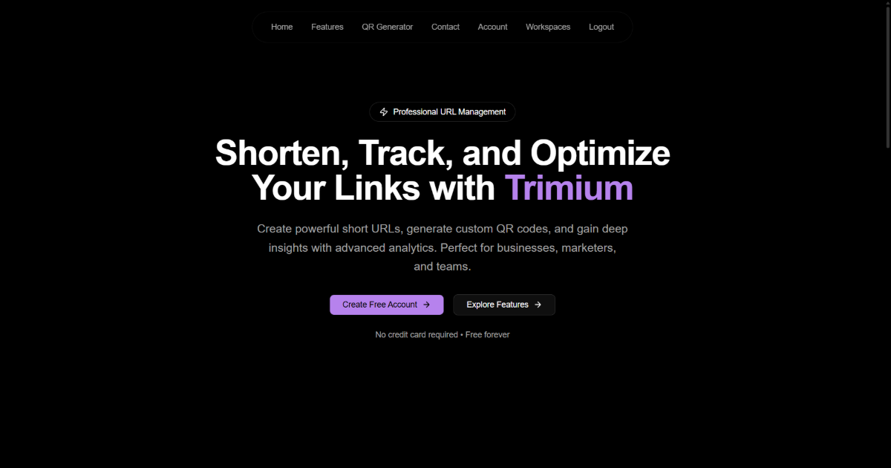

# Trimium

[](https://trimium.vercel.app/)
[](LICENSE)
[](https://github.com/IamDevTrivedi/Trimium)


A professional URL shortener and link management platform. Create powerful short URLs, generate custom QR codes, and gain deep insights with advanced analytics. Perfect for businesses, marketers, and teams.

---



---

## Features

- **URL Shortening**: 
   - Create short, memorable URLs with custom aliases.
   - Get useful Analytics like Total lands, total redirects, Unique visitors, Top referrers, Top countries, Browsers & OS stats, and more.
   - create Expiring links that automatically deactivate after a set period or number of clicks.
   - Schedule links to go live at a specific date and time. Countdown with custom message before activation.
   - Optionally protect your links with passwords.
   - Organize links using tags for easy management and retrieval.
   - Bulk URL shortening to create multiple short links in one go, saving time and effort.
   - Export analytics reports in CSV format for further analysis.
   - Edit short URLs properties as per need.

- **Workspace Management**: 
   - Create and manage multiple workspaces for different projects or teams.
   - Invite team members with role-based access control (Admin, Member, Viewer).
   - Shared link management and analytics within workspaces.
   - Create Tags to categorize and manage links effectively.
   - leave or delete workspaces as needed.
   
- **QR Code Generation**:
   - Generate customizable QR codes for each short URL.
   - Download QR codes in various formats (PNG, SVG).

- **User Authentication & Profile Management**:
   - Secure user registration and login with email verification.
   - Password reset functionality.
   - User profile management with the ability to update personal information and change passwords.
   - Session management to view and terminate active sessions.

## Tech Stack

### Frontend (Client)

- **Next.js 16** — React framework with App Router
- **React 19** — UI library
- **TypeScript** — Type-safe development
- **Tailwind CSS 4** — Utility-first CSS framework
- **shadcn/ui** — Accessible component library
- **Zustand** — State management
- **React Hook Form + Zod** — Form handling and validation
- **Recharts** — Data visualization
- **Motion** — Animations

### Backend (Server)

- **Express 5** — Node.js web framework
- **TypeScript** — Type-safe development
- **MongoDB + Mongoose** — Database and ODM
- **Redis** — Caching and rate limiting
- **JWT** — Authentication tokens
- **Nodemailer** — Email sending
- **Pino** — Logging
- **Zod** — Request validation

### Development Tools

- **pnpm** — Fast, disk space efficient package manager
- **ESLint** — Code linting
- **Prettier** — Code formatting
- **Concurrently** — Run multiple scripts

## Getting Started

### Prerequisites

- **Node.js** (v18 or higher)
- **pnpm** (v10.27.0 recommended)
- **MongoDB** (local or Atlas)
- **Redis** (local or cloud)

### Installation

1. **Clone the repository**

   ```bash
   git clone https://github.com/IamDevTrivedi/Trimium.git
   cd Trimium
   ```

2. **Install all dependencies**

   ```bash
   # recommended to use pnpm
   pnpm install:all

   # alternatively, you can use npm or yarn in each of the client and server directories
   npm run install:all

   # or
   yarn run install:all
   ```

3. **Set up environment variables**

    Please refer to the `.env.example` files in both `client` and `server` directories.

4. **Start the development mode**

   ```bash
   pnpm dev
   ```

   This will start both the client & server concurrently. The PORTs will be picked from the respective env files. 

### Available Scripts

| Command | Description |
|---------|-------------|
| `pnpm dev` | Start both client and server in development mode |
| `pnpm install:all` | Install dependencies for root, client, and server |
| `pnpm clean:all` | Clean all node_modules and lock files |
| `pnpm reset:all` | Clean and reinstall all dependencies |
| `pnpm format` | Format code with Prettier |
| `pnpm format:check` | Check code formatting with Prettier |
| `pnpm lint` | Run ESLint |
| `pnpm lint:fix` | Fix ESLint issues |

## Project Structure

Please refer to the [DIRECTORY_STRUCTURE.md](docs/DIRECTORY_STRUCTURE.md) file for a detailed overview of the project structure.

## License

This project is licensed under the MIT License — see the [LICENSE](LICENSE) file for details.
