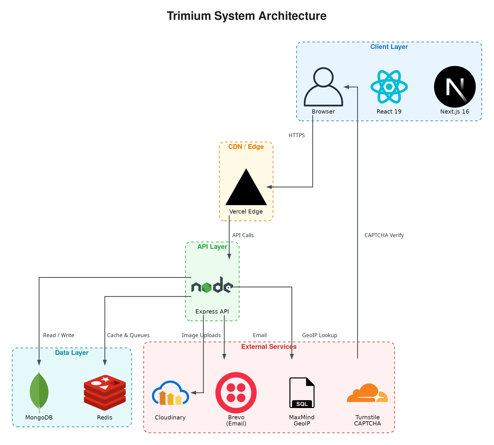

<div align="center">
  

# Trimium

[](https://trimium.vercel.app/)
[](LICENSE)
[](https://github.com/IamDevTrivedi/Trimium/actions)
<br>


A professional URL shortener and link management platform. Create short URLs, generate QR codes, manage team workspaces, and gain deep insights with analytics.

</div>

---

## Features

- **URL Shortening** — Custom aliases, expiring links, scheduled links, password protection, bulk creation, tags, CSV analytics export, and full edit capabilities.
- **Analytics** — Track total clicks, unique visitors, top referrers, geographic data (country-level), browser & OS breakdown, and redirect timelines.
- **QR Code Generation** — Auto-generated QR codes for every short link, downloadable in PNG and SVG formats.
- **Link-in-Bio (Linkhub)** — Fully customizable landing pages with themes, social links, custom buttons, and rich text content.
- **Team Workspaces** — Multi-workspace support with role-based access (Admin, Member, Viewer), shared link management, member invitations, and tagging.
- **User Authentication** — Email-verified registration, secure password reset, profile management, and session tracking with the ability to view/terminate active sessions.

> [!TIP]
> Visit **[trimium.vercel.app](https://trimium.vercel.app/)** to try the live application.

## Tech Stack

### Frontend

| Technology                     | Purpose                                 |
| ------------------------------ | --------------------------------------- |
| **Next.js 16** (App Router)    | React framework                         |
| **React 19**                   | UI library                              |
| **TypeScript**                 | Type safety                             |
| **Tailwind CSS 4**             | Utility-first CSS                       |
| **shadcn/ui** + @base-ui/react | Accessible component library            |
| **Zustand**                    | State management                        |
| **React Hook Form + Zod**      | Form handling & validation              |
| **Recharts**                   | Data visualization (analytics charts)   |
| **Axios**                      | HTTP client (with PoW challenge solver) |

### Backend

| Technology                                | Purpose                                         |
| ----------------------------------------- | ----------------------------------------------- |
| **Express 5**                             | Web framework                                   |
| **TypeScript**                            | Type safety                                     |
| **MongoDB + Mongoose**                    | Database & ODM                                  |
| **Redis** (ioredis)                       | Caching, rate limiting, job queues              |
| **BullMQ**                                | Background job queues (email, activity updates) |
| **JWT**                                   | Authentication tokens with token versioning     |
| **Argon2**                                | Password hashing                                |
| **Zod**                                   | Request & environment validation                |
| **Brevo API** (Sendinblue)                | Transactional email delivery                    |
| **Cloudinary**                            | Image & file upload management                  |
| **MaxMind GeoIP**                         | IP geolocation (country, city)                  |
| **ua-parser-js**                          | User-agent parsing                              |
| **Pino**                                  | Structured logging                              |
| **express-rate-limit + rate-limit-redis** | Rate limiting                                   |

### DevOps & Tooling

| Technology            | Purpose                                    |
| --------------------- | ------------------------------------------ |
| **Bun** (v1.1+)       | Runtime, package manager, bundler          |
| **Turbopack**         | Next.js bundler                            |
| **Husky**             | Git hooks (pre-commit lint + format check) |
| **ESLint + Prettier** | Code quality & formatting                  |
| **GitHub Actions**    | CI/CD (Vercel client + VPS server)         |
| **Dependabot**        | Automated dependency updates               |
| **PM2**               | Production server process manager          |

## Architecture

Trimium follows a **monorepo structure** with two packages managed by Bun workspaces:

```
Trimium/
├── client/          # Next.js frontend (App Router, route groups)
├── server/          # Express backend (feature-based modules)
├── scripts/         # Utility scripts (install, clean, reset, GeoIP update)
├── docs/            # Architecture and setup documentation
└── .github/         # CI/CD workflow
```

The server uses a **feature-based modular architecture** — each domain (`auth`, `url`, `workspace`, `linkhub`, `user`, `contact`) is isolated in `server/src/modules/<name>/` with a `routes.ts` + `controllers.ts` pair.



### Security Highlights

- **JWT authentication** with cookie-based sessions and **token versioning** (stored in User and LoginHistory models) for instant session invalidation across all devices.
- **Redis-backed rate limiting** with adaptive **Proof-of-Work (SHA-256 hashcash)** challenges — when a client exceeds the rate limit, the server issues a computational puzzle that the client-side Axios interceptor automatically solves and retries.
- **Cloudflare Turnstile** CAPTCHA verification on public forms.
- **Argon2** password hashing.

## Getting Started

### Prerequisites

- **Bun** >= 1.1
- **MongoDB** instance (local or Atlas)
- **Redis** instance (local or cloud)
- **MaxMind GeoLite2** license key (for geo-analytics)

> For detailed setup instructions, refer to [docs/SETUP.md](./docs/SETUP.md).

### Project Structure

For a full directory breakdown, see [docs/DIRECTORY_STRUCTURE.md](./docs/DIRECTORY_STRUCTURE.md).

## Deployment

The project uses an automated CI/CD pipeline via GitHub Actions:

- **Client** — Built and deployed to **Vercel** on every push to `main`.
- **Server** — Deployed to a **VPS** with zero-downtime PM2 reload, health check verification, and automatic rollback to the previous release on failure.

## License

Licensed under the [MIT License](LICENSE).
