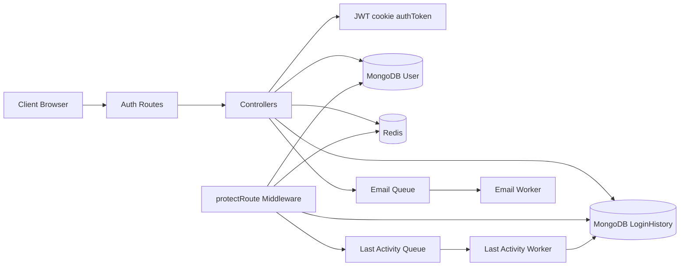
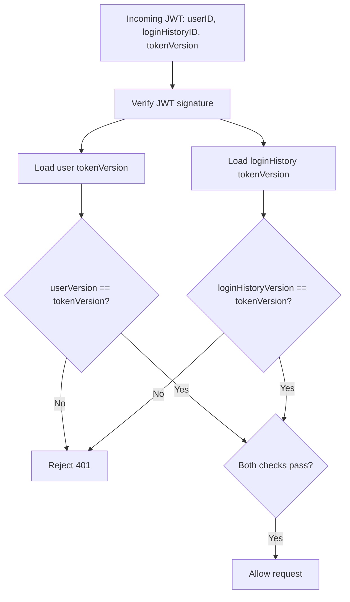
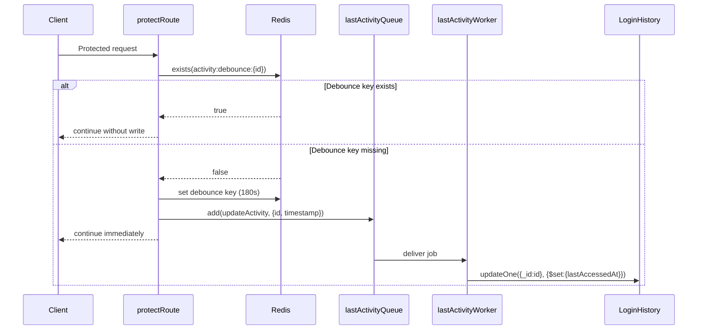
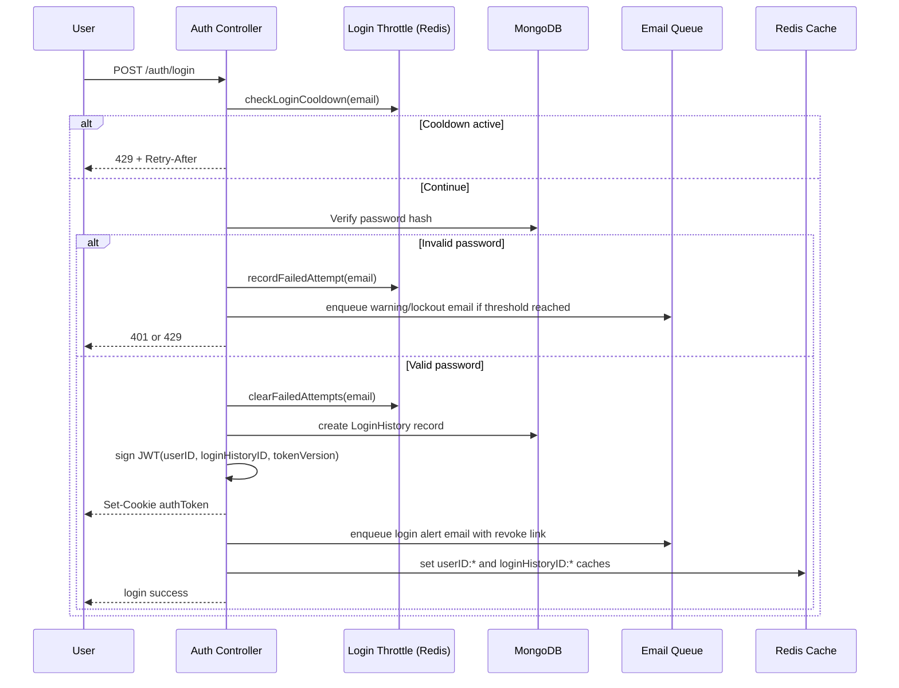
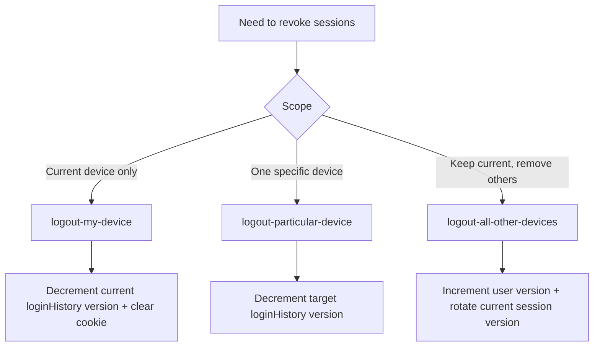
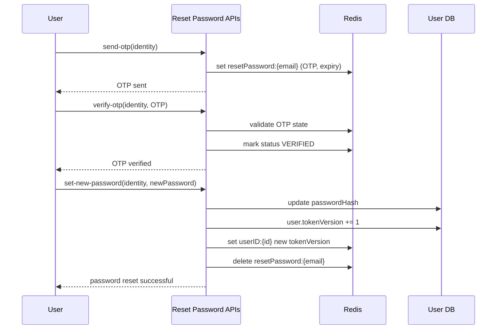
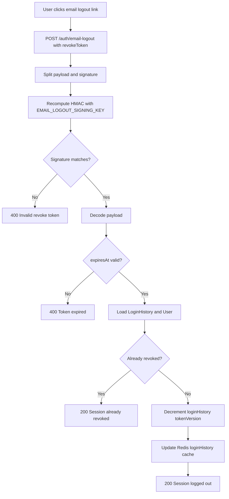
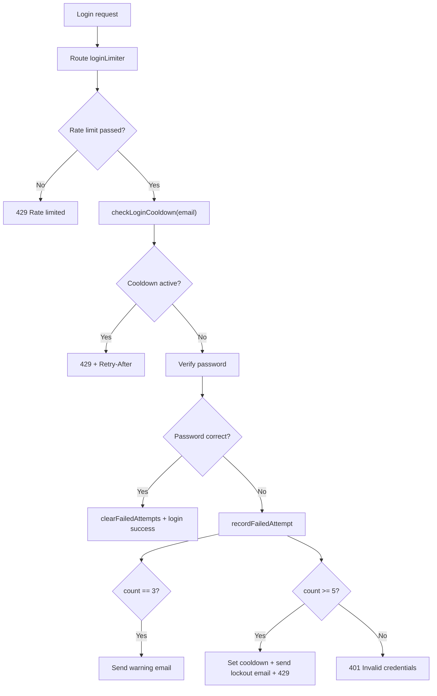

# Trimium Authentication and Session Management Architecture

Source of truth:

- server/src/modules/auth/controllers.ts
- server/src/modules/auth/routes.ts
- server/src/middlewares/protectRoute.ts
- server/src/utils/loginThrottle.ts
- server/src/modules/queue/queues.ts
- server/src/modules/queue/workers.ts
- server/src/modules/queue/processors/updateLastActivity.ts
- server/src/models/user.ts
- server/src/models/loginHistory.ts

This document explains how Trimium authenticates users, validates sessions, enforces device-level logout controls, and protects login from brute-force attacks while keeping protected-route latency low.

## Overview

What this design demonstrates:

- Stateless JWT auth with server-side revocation control.
- Per-user and per-device session invalidation model.
- Performance-aware middleware with Redis caching and async workers.
- Multi-path logout controls (current device, other devices, specific device, email alert link).
- Layered anti-abuse strategy (rate limit + account-level cooldown).

## Architecture At A Glance

## JWT Design

### Token shape and transport

- JWT is created during login and sent in `authToken` HTTP-only cookie.
- Expiration: 7 days (`expiresIn: "7d"`).
- Cookie strategy:
    - `httpOnly: true`
    - `sameSite: lax` in development, `none` in production
    - `secure` in production
    - `path: /`

JWT payload fields:

- `userID`
- `loginHistoryID`
- `tokenVersion`

### Why tokenVersion exists at two levels

Trimium uses a dual-version revocation model:

- User-level `tokenVersion` (in `User`): global/session-group invalidation.
- Device-level `tokenVersion` (in `LoginHistory`): single-session invalidation.

A token is accepted only if both versions match the JWT payload version.

## Middleware Design

`protectRoute` is the session gate for protected endpoints.

Primary responsibilities:

- Read and verify JWT from cookie.
- Validate user-level token version.
- Validate loginHistory-level token version.
- Set `res.locals` context (`userID`, `loginHistoryID`, `tokenVersion`).
- Trigger debounced last-activity write via queue.

### Response-time optimization by caching

To avoid MongoDB read pressure on every protected request, `protectRoute` reads token versions from Redis first.

Cache pattern:

| Key                               | Value                       | TTL    | Miss fallback                   |
| --------------------------------- | --------------------------- | ------ | ------------------------------- |
| `userID:{userID}`                 | User `tokenVersion`         | 1 hour | Query `User` collection         |
| `loginHistoryID:{loginHistoryID}` | LoginHistory `tokenVersion` | 1 hour | Query `LoginHistory` collection |

Performance impact:

- Hot-session authorization is mostly Redis-backed.
- DB reads occur mostly on cold keys and after cache expiry.
- Revocation propagates quickly because write paths update Redis immediately after version changes.

### Last-activity update via background worker

Trimium avoids synchronous DB writes for each authenticated request.

Design details:

- Debounce key: `activity:debounce:{loginHistoryID}` in Redis.
- Debounce TTL: 3 minutes.
- If key exists: skip enqueue.
- If key missing: set key and enqueue `updateActivity` job.
- Worker updates `LoginHistory.lastAccessedAt` asynchronously.

## Login Flow and Session Creation

## Device and Session Logout Controls

### Logout my device

Endpoint: `POST /api/v1/auth/logout-my-device`

- Requires `protectRoute`.
- Decrements current `LoginHistory.tokenVersion`.
- Updates Redis cache for that login history.
- Clears auth cookie.
- Result: current device session is invalidated immediately.

### Logout all other devices

Endpoint: `POST /api/v1/auth/logout-all-other-devices`

- Requires `protectRoute`.
- Increments `User.tokenVersion` (invalidates all old sessions globally).
- Increments current `LoginHistory.tokenVersion` and issues a fresh JWT for current device.
- Result: current device stays logged in; every other device is logged out.

### Logout particular device

Endpoint: `POST /api/v1/auth/logout-particular-device`

- Requires `protectRoute`.
- Input: `targetLoginHistoryID`.
- Blocks self-target logout (cannot use this endpoint for current device).
- Finds target login history under current version scope.
- Decrements target `LoginHistory.tokenVersion`.
- Updates Redis cache for target session.
- Result: only the selected device is logged out.

When a user resets their password, all existing sessions are revoked by incrementing the `User.tokenVersion`. This forces all previously issued JWTs to fail validation on the next request, effectively logging out the user from every device.

## Reset Password and Global Session Invalidation

Reset password is OTP-gated and doubles as a security reset of active sessions.

Flow summary:

1. `send-otp` stores OTP state in Redis (`resetPassword:{email}`) with expiry.
2. `verify-otp` marks state as verified.
3. `set-new-password` updates password hash and increments `User.tokenVersion`.

Security effect:

- Incrementing user token version revokes every previously issued JWT across all devices.

## Logout From Login Alert Email

Trimium sends a login alert email on successful login with a signed revoke link.

Token structure:

- Payload (base64url JSON): `loginHistoryID`, `expiresAt`
- Signature: HMAC-SHA256 using `EMAIL_LOGOUT_SIGNING_KEY`
- Final format: `{payloadB64}.{signature}`
- Expiration constant: `REVOKE_TOKEN_EXPIRATION_TIME` (3 hours)

Verification behavior in `emailLogout`:

- Validate signature with timing-safe comparison.
- Validate expiry.
- Load target `LoginHistory` and owning `User`.
- If already invalidated, return idempotent success.
- Otherwise decrement target session `tokenVersion` and update Redis cache.

## Login Throttle for Brute-Force Prevention

Trimium uses two complementary control layers.

### Layer 1: Route-level rate limiting

- `POST /auth/login` is protected by `loginLimiter`.
- policy: 10 requests per 15 minutes per rate-limit key.
- Backed by Redis via `createRateLimiter` middleware.

### Layer 2: Account-level credential throttle

In `loginThrottle` (Redis-backed):

- Failed attempts key: `login:failed:{email}` with 30-minute TTL.
- Cooldown key: `login:cooldown:{email}` with 15-minute TTL.
- Warning threshold: 3 failed attempts (warning email queued).
- Lockout threshold: 5 failed attempts (temporary lockout + lockout email queued).
- Successful login clears failed-attempt counter.

This gives both network-level and account-level defense.

## Endpoint Map (Session-Relevant)

| Endpoint                                            | Purpose                                    | Auth Required |
| --------------------------------------------------- | ------------------------------------------ | ------------- |
| `POST /api/v1/auth/login`                           | Issue JWT cookie and create device session | No            |
| `POST /api/v1/auth/logout-my-device`                | Logout current device                      | Yes           |
| `POST /api/v1/auth/logout-all-other-devices`        | Keep current device, revoke all others     | Yes           |
| `POST /api/v1/auth/logout-particular-device`        | Revoke one selected device                 | Yes           |
| `POST /api/v1/auth/email-logout`                    | Revoke session via login-alert link        | No            |
| `POST /api/v1/auth/reset-password/send-otp`         | Start password reset                       | No            |
| `POST /api/v1/auth/reset-password/verify-otp`       | Validate reset OTP                         | No            |
| `POST /api/v1/auth/reset-password/set-new-password` | Set new password and invalidate sessions   | No            |
| `POST /api/v1/auth/login-history`                   | Inspect sessions/devices                   | Yes           |

## Key Takeaways

This architecture reflects production-grade security and performance thinking:

- Session revocation is deterministic through version checks, not token blacklists.
- Authorization path is optimized with Redis-first reads.
- Activity auditing is async and debounced to reduce write amplification.
- Device-level and account-level controls provide fine-grained incident response.
- Brute-force protection is layered and user-notified through queued emails.
