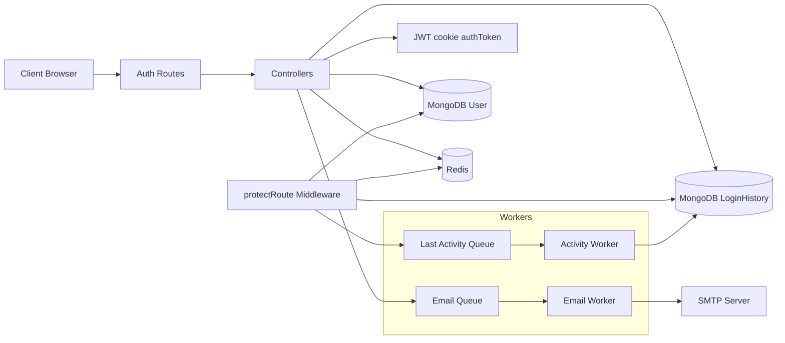
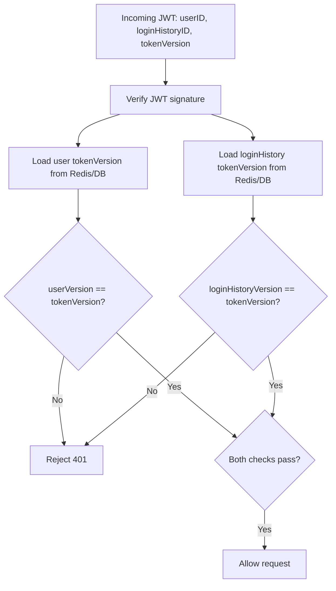
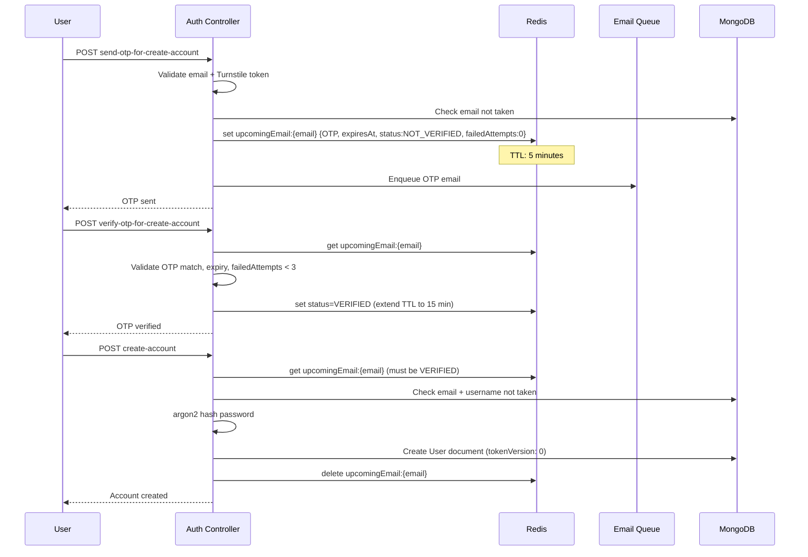
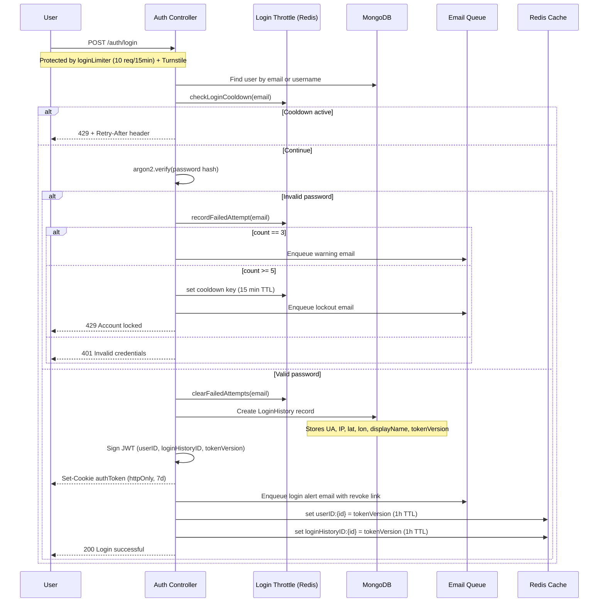
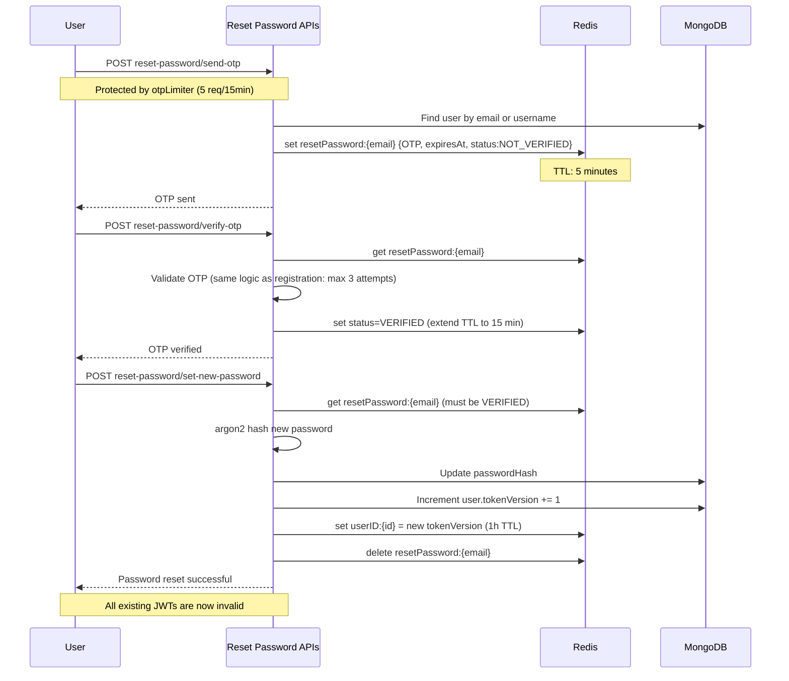
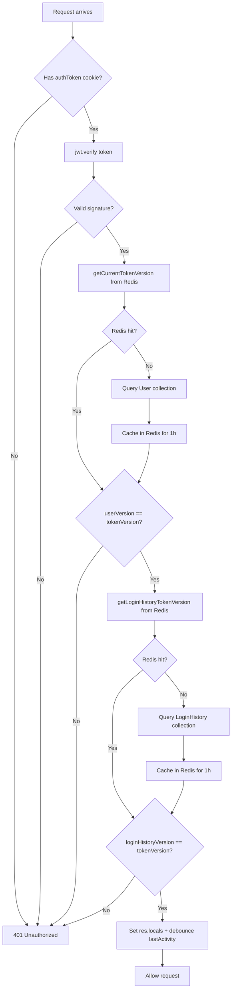
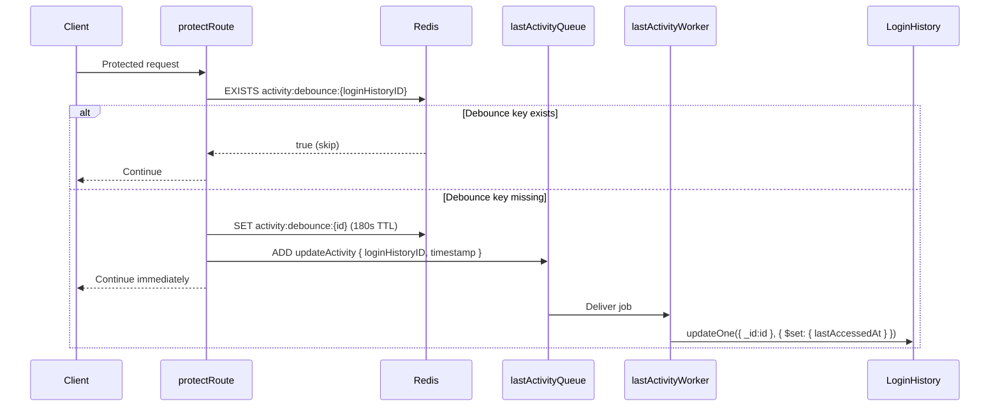
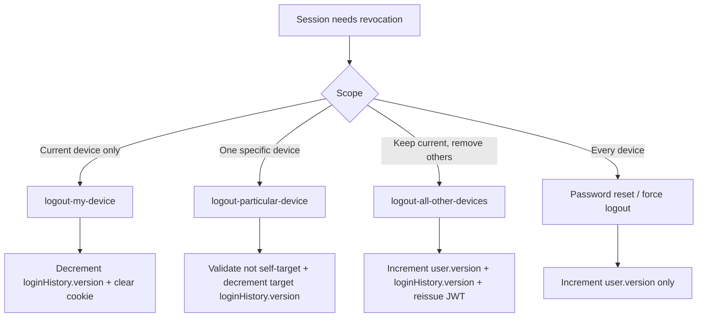
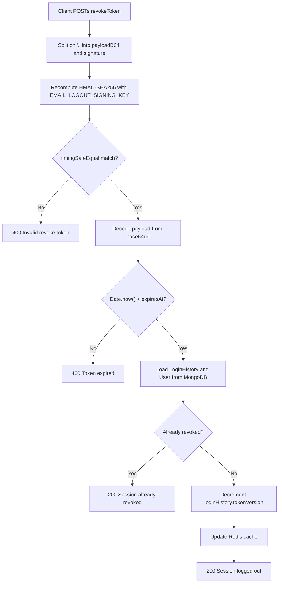
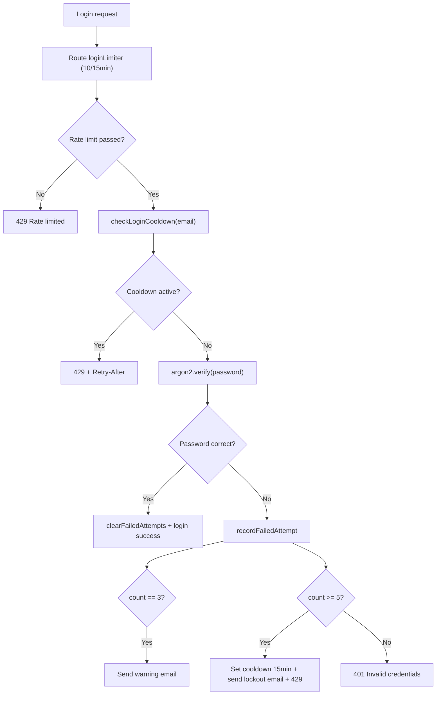

# Authentication and Session Management Architecture

This document describes how Trimium authenticates users, manages sessions, enforces device-level logout controls, protects login from brute-force attacks, and handles account registration — while keeping protected-route latency low.

---

## Overview

The authentication system is built around these design goals:

- **Stateless JWT** with server-side revocation control via token versioning
- **Per-user and per-device** session invalidation model
- **Performance-aware middleware** with Redis-first reads and async background workers
- **Multi-path logout controls** — current device, other devices, specific device, and email alert link
- **Layered anti-abuse strategy** — network rate limits, account-level cooldown, and OTP brute-force protection


```mermaid
flowchart LR
    C[Client Browser] --> A[Auth Routes]
    A --> B[Controllers]

    B --> D[JWT cookie authToken]
    B --> E[(MongoDB User)]
    B --> F[(MongoDB LoginHistory)]
    B --> G[(Redis)]
    B --> H[Email Queue]

    I[protectRoute Middleware] --> G
    I --> E
    I --> F
    I --> J[Last Activity Queue]

    subgraph Workers
        H --> K[Email Worker]
        J --> L[Activity Worker]
    end

    K --> M[SMTP Server]
    L --> F
```

---

## Core Concepts

### JWT Design

The JWT is created on login and delivered via an HTTP-only cookie.

| Property    | Value                                    |
| ----------- | ---------------------------------------- |
| Cookie name | `authToken`                              |
| Expiration  | 7 days (`expiresIn: "7d"`)               |
| `httpOnly`  | `true`                                   |
| `sameSite`  | `lax` (development), `none` (production) |
| `secure`    | `true` in production                     |
| `path`      | `/`                                      |

JWT payload fields:

```json
{
    "userID": "string",
    "loginHistoryID": "string",
    "tokenVersion": "number"
}
```

### Dual Token Version Model

Trimium uses a two-level versioning scheme for session revocation:

- **User-level `tokenVersion`** (stored in `User` model): global invalidation. Incrementing it revokes every session across all devices at once.
- **Device-level `tokenVersion`** (stored in `LoginHistory` model): single-session invalidation. Decrementing it revokes only that specific device.

A JWT is accepted only if **both** versions stored in the database match the versions embedded in the token payload.


```mermaid
flowchart TD
    T[Incoming JWT: userID, loginHistoryID, tokenVersion] --> A[Verify JWT signature]
    A --> B[Load user tokenVersion from Redis/DB]
    A --> C[Load loginHistory tokenVersion from Redis/DB]

    B --> D{userVersion == tokenVersion?}
    C --> E{loginHistoryVersion == tokenVersion?}

    D -- No --> X[Reject 401]
    E -- No --> X
    D -- Yes --> Y{Both checks pass?}
    E -- Yes --> Y
    Y -- Yes --> Z[Allow request]
```

---

## Authentication Flows

### Account Creation

Registration is a three-step OTP-gated flow. Each step is rate-limited by `otpLimiter` (5 requests per 15 minutes).


```mermaid
sequenceDiagram
    participant U as User
    participant API as Auth Controller
    participant R as Redis
    participant EQ as Email Queue
    participant DB as MongoDB

    U->>API: POST send-otp-for-create-account
    API->>API: Validate email + Turnstile token
    API->>DB: Check email not taken
    API->>R: set upcomingEmail:{email} {OTP, expiresAt, status:NOT_VERIFIED, failedAttempts:0}
    Note over R: TTL: 5 minutes
    API->>EQ: Enqueue OTP email
    API-->>U: OTP sent

    U->>API: POST verify-otp-for-create-account
    API->>R: get upcomingEmail:{email}
    API->>API: Validate OTP match, expiry, failedAttempts < 3
    API->>R: set status=VERIFIED (extend TTL to 15 min)
    API-->>U: OTP verified

    U->>API: POST create-account
    API->>R: get upcomingEmail:{email} (must be VERIFIED)
    API->>DB: Check email + username not taken
    API->>API: argon2 hash password
    API->>DB: Create User document (tokenVersion: 0)
    API->>R: delete upcomingEmail:{email}
    API-->>U: Account created
```

**OTP security properties:**

| Property            | Value                                                 |
| ------------------- | ----------------------------------------------------- |
| OTP storage key     | `upcomingEmail:{email}`                               |
| OTP length          | 6 digits (generated by `generateOTP`)                 |
| Max failed attempts | 3 (invalidates the OTP and deletes the key)           |
| Unverified TTL      | 5 minutes                                             |
| Verified TTL        | 15 minutes (gives user time to complete registration) |
| Rate limiter        | `otpLimiter`: 5 requests per 15 minutes               |

### Login


```mermaid
sequenceDiagram
    participant U as User
    participant API as Auth Controller
    participant LT as Login Throttle (Redis)
    participant DB as MongoDB
    participant EQ as Email Queue
    participant R as Redis Cache

    U->>API: POST /auth/login
    Note over U,API: Protected by loginLimiter (10 req/15min) + Turnstile

    API->>DB: Find user by email or username
    API->>LT: checkLoginCooldown(email)

    alt Cooldown active
        API-->>U: 429 + Retry-After header
    else Continue
        API->>API: argon2.verify(password hash)

        alt Invalid password
            API->>LT: recordFailedAttempt(email)
            alt count == 3
                API->>EQ: Enqueue warning email
            else count >= 5
                API->>LT: set cooldown key (15 min TTL)
                API->>EQ: Enqueue lockout email
                API-->>U: 429 Account locked
            else
                API-->>U: 401 Invalid credentials
            end
        else Valid password
            API->>LT: clearFailedAttempts(email)
            API->>DB: Create LoginHistory record
            Note over DB: Stores UA, IP, lat, lon, displayName, tokenVersion
            API->>API: Sign JWT (userID, loginHistoryID, tokenVersion)
            API-->>U: Set-Cookie authToken (httpOnly, 7d)

            API->>EQ: Enqueue login alert email with revoke link
            API->>R: set userID:{id} = tokenVersion (1h TTL)
            API->>R: set loginHistoryID:{id} = tokenVersion (1h TTL)
            API-->>U: 200 Login successful
        end
    end
```

### Password Reset

Reset password is OTP-gated and doubles as a security reset — it increments `User.tokenVersion` to revoke all active sessions.


```mermaid
sequenceDiagram
    participant U as User
    participant API as Reset Password APIs
    participant R as Redis
    participant DB as MongoDB

    U->>API: POST reset-password/send-otp
    Note over U,API: Protected by otpLimiter (5 req/15min)
    API->>DB: Find user by email or username
    API->>R: set resetPassword:{email} {OTP, expiresAt, status:NOT_VERIFIED}
    Note over R: TTL: 5 minutes
    API-->>U: OTP sent

    U->>API: POST reset-password/verify-otp
    API->>R: get resetPassword:{email}
    API->>API: Validate OTP (same logic as registration: max 3 attempts)
    API->>R: set status=VERIFIED (extend TTL to 15 min)
    API-->>U: OTP verified

    U->>API: POST reset-password/set-new-password
    API->>R: get resetPassword:{email} (must be VERIFIED)
    API->>API: argon2 hash new password
    API->>DB: Update passwordHash
    API->>DB: Increment user.tokenVersion += 1
    API->>R: set userID:{id} = new tokenVersion (1h TTL)
    API->>R: delete resetPassword:{email}
    API-->>U: Password reset successful
    Note over U,API: All existing JWTs are now invalid
```

---

## Session Management

### Token Validation Middleware

`protectRoute` is the gate for all protected endpoints. Responsibilities:

1. Read and verify JWT from the `authToken` cookie
2. Validate user-level token version
3. Validate loginHistory-level token version
4. Populate `res.locals` with `{ userID, loginHistoryID, tokenVersion }`
5. Trigger debounced last-activity write via BullMQ queue

#### Redis-First Cache Strategy

To minimize MongoDB read pressure on every request, token versions are read from Redis first.

| Cache key                         | Value                       | TTL    | Miss fallback                                      |
| --------------------------------- | --------------------------- | ------ | -------------------------------------------------- |
| `userID:{userID}`                 | User `tokenVersion`         | 1 hour | `User.findById(id).select("tokenVersion")`         |
| `loginHistoryID:{loginHistoryID}` | LoginHistory `tokenVersion` | 1 hour | `LoginHistory.findById(id).select("tokenVersion")` |

**Performance characteristics:**

- Hot sessions are authorized entirely via Redis (sub-millisecond)
- MongoDB reads occur only on cold keys or after cache expiry
- Token version writes immediately update Redis, so revocation propagates instantly


```mermaid
flowchart TD
    A[Request arrives] --> B{Has authToken cookie?}
    B -- No --> C[401 Unauthorized]
    B -- Yes --> D[jwt.verify token]
    D --> E{Valid signature?}
    E -- No --> C
    E -- Yes --> F[getCurrentTokenVersion from Redis]
    F --> G{Redis hit?}
    G -- No --> H[Query User collection]
    H --> I[Cache in Redis for 1h]
    G -- Yes --> J{userVersion == tokenVersion?}
    I --> J
    J -- No --> C
    J -- Yes --> K[getLoginHistoryTokenVersion from Redis]
    K --> L{Redis hit?}
    L -- No --> M[Query LoginHistory collection]
    M --> N[Cache in Redis for 1h]
    L -- Yes --> O{loginHistoryVersion == tokenVersion?}
    N --> O
    O -- No --> C
    O -- Yes --> P[Set res.locals + debounce lastActivity]
    P --> Q[Allow request]
```

#### Last Activity Tracking

Trimium avoids synchronous database writes on every authenticated request by using a debounced background job.


```mermaid
sequenceDiagram
    participant Client
    participant PR as protectRoute
    participant Redis
    participant Queue as lastActivityQueue
    participant Worker as lastActivityWorker
    participant DB as LoginHistory

    Client->>PR: Protected request
    PR->>Redis: EXISTS activity:debounce:{loginHistoryID}

    alt Debounce key exists
        Redis-->>PR: true (skip)
        PR-->>Client: Continue
    else Debounce key missing
        PR->>Redis: SET activity:debounce:{id} (180s TTL)
        PR->>Queue: ADD updateActivity { loginHistoryID, timestamp }
        PR-->>Client: Continue immediately
        Queue->>Worker: Deliver job
        Worker->>DB: updateOne({ _id:id }, { $set: { lastAccessedAt } })
    end
```

**Queue configuration:**

| Property                | `lastActivityQueue` | `emailQueue`           |
| ----------------------- | ------------------- | ---------------------- |
| Retries                 | 1                   | 3                      |
| Backoff                 | None                | Exponential (3s delay) |
| Auto-remove on complete | Yes                 | No                     |
| Auto-remove on fail     | Yes                 | No                     |

### Session Invalidation Strategies

Trimium provides four distinct session invalidation paths:

#### 1. Logout Current Device

`POST /api/v1/auth/logout-my-device`

- Decrements the current `LoginHistory.tokenVersion`
- Updates the Redis cache for that login history
- Clears the `authToken` cookie
- **Result:** only the current device is logged out

#### 2. Logout All Other Devices

`POST /api/v1/auth/logout-all-other-devices`

- Increments `User.tokenVersion` (invalidates all old sessions globally)
- Increments the current `LoginHistory.tokenVersion` (brings it in sync with the new user version)
- Issues a fresh JWT for the current device
- **Result:** current device stays logged in; every other device is logged out

#### 3. Logout a Specific Device

`POST /api/v1/auth/logout-particular-device`

- Accepts `targetLoginHistoryID` in the request body
- Blocks self-targeting (cannot use this endpoint on the current device)
- Finds the target login history scoped by the current `tokenVersion`
- Decrements the target device's `LoginHistory.tokenVersion`
- Updates the Redis cache for the target session
- **Result:** only the selected device is logged out

#### 4. Global Invalidation (Password Reset)

When a user resets their password, `User.tokenVersion` is incremented. This forces all previously issued JWTs to fail validation on the next request, logging the user out from every device.


```mermaid
flowchart TD
    A[Session needs revocation] --> B{Scope}

    B -- Current device only --> C[logout-my-device]
    B -- One specific device --> D[logout-particular-device]
    B -- Keep current, remove others --> E[logout-all-other-devices]
    B -- Every device --> F[Password reset / force logout]

    C --> C1[Decrement loginHistory.version + clear cookie]
    D --> D1[Validate not self-target + decrement target loginHistory.version]
    E --> E1[Increment user.version + loginHistory.version + reissue JWT]
    F --> F1[Increment user.version only]
```

---

## Email-Based Logout

Each successful login triggers a **login alert email** containing a signed revoke link. This allows users to remotely terminate a session without needing to log in.

### Revoke Token Structure

| Component  | Description                                             |
| ---------- | ------------------------------------------------------- |
| Payload    | Base64url-encoded JSON: `{ loginHistoryID, expiresAt }` |
| Signature  | HMAC-SHA256 using `EMAIL_LOGOUT_SIGNING_KEY`            |
| Format     | `{payloadB64}.{signature}`                              |
| Expiration | 3 hours (`REVOKE_TOKEN_EXPIRATION_TIME`)                |

### Client-Side Flow

The revoke link points to the **client-side page** at `FRONTEND_URL/email-logout?revokeToken=...`. This page:

1. Extracts the `revokeToken` query parameter
2. Calls `POST /api/v1/auth/email-logout` with the token
3. Renders one of three UI states: **success**, **error**, or **expired**

### Server-Side Verification


```mermaid
flowchart TD
    A[Client POSTs revokeToken] --> B[Split on '.' into payloadB64 and signature]
    B --> C[Recompute HMAC-SHA256 with EMAIL_LOGOUT_SIGNING_KEY]

    C --> D{timingSafeEqual match?}
    D -- No --> X[400 Invalid revoke token]
    D -- Yes --> E[Decode payload from base64url]

    E --> F{"Date.now() < expiresAt?"}
    F -- No --> Y[400 Token expired]
    F -- Yes --> G[Load LoginHistory and User from MongoDB]

    G --> H{Already revoked?}
    H -- Yes --> Z[200 Session already revoked]
    H -- No --> I[Decrement loginHistory.tokenVersion]
    I --> J[Update Redis cache]
    J --> K[200 Session logged out]
```

---

## Anti-Abuse Architecture

Trimium implements three complementary defense layers.

### Layer 1: Route-Level Rate Limiting

Each auth endpoint has a dedicated rate limiter backed by Redis.

| Rate Limiter           | Applied To                  | Window | Max Requests |
| ---------------------- | --------------------------- | ------ | ------------ |
| `loginLimiter`         | `POST /auth/login`          | 15 min | 10           |
| `otpLimiter`           | All OTP endpoints           | 15 min | 5            |
| `authGeneralLimiter`   | Logout, profile, history    | 1 min  | 60           |
| `usernameCheckLimiter` | `POST /auth/check-username` | 1 min  | 30           |

When a rate limit is exceeded, the server may issue a **Proof-of-Work challenge** (SHA-256 hashcash) instead of a hard 429. The client-side Axios interceptor automatically solves the puzzle and retries the request.

### Layer 2: Account-Level Credential Throttle

The `loginThrottle` module provides Redis-backed per-account protection.


```mermaid
flowchart TD
    A["Login request"] --> B["Route loginLimiter (10/15min)"]
    B --> C{"Rate limit passed?"}
    C -- No --> C1["429 Rate limited"]
    C -- Yes --> D["checkLoginCooldown(email)"]

    D --> E{"Cooldown active?"}
    E -- Yes --> E1["429 + Retry-After"]
    E -- No --> F["argon2.verify(password)"]

    F --> G{"Password correct?"}
    G -- Yes --> H["clearFailedAttempts + login success"]
    G -- No --> I["recordFailedAttempt"]

    I --> J{"count == 3?"}
    J -- Yes --> J1["Send warning email"]

    I --> K{"count >= 5?"}
    K -- Yes --> K1["Set cooldown 15min + send lockout email + 429"]
    K -- No --> K2["401 Invalid credentials"]
```

**Configuration:**

| Property            | Value                                 |
| ------------------- | ------------------------------------- |
| Failed attempts key | `login:failed:{email}` (30 min TTL)   |
| Cooldown key        | `login:cooldown:{email}` (15 min TTL) |
| Warning threshold   | 3 failed attempts                     |
| Lockout threshold   | 5 failed attempts                     |

> [!NOTE]
> Both `checkLoginCooldown` and `recordFailedAttempt` fail open on Redis errors — they return safe defaults (`blocked: false`, `shouldWarn: false`) rather than blocking legitimate users due to infrastructure issues.

### Layer 3: OTP Brute-Force Protection

OTP verification tracks `failedAttempts` in the Redis state object. After 3 failed OTP attempts, the OTP record is deleted, forcing the user to request a new one.

---

## Endpoint Reference

| Endpoint                                     | Purpose                       | Rate Limiter                    | Auth |
| -------------------------------------------- | ----------------------------- | ------------------------------- | ---- |
| `POST /auth/send-otp-for-create-account`     | Begin registration            | `otpLimiter` (5/15min)          | No   |
| `POST /auth/verify-otp-for-create-account`   | Verify registration OTP       | `otpLimiter` (5/15min)          | No   |
| `POST /auth/create-account`                  | Complete registration         | `otpLimiter` (5/15min)          | No   |
| `POST /auth/login`                           | Issue JWT + create session    | `loginLimiter` (10/15min)       | No   |
| `POST /auth/logout-my-device`                | Logout current device         | `authGeneralLimiter` (60/min)   | Yes  |
| `POST /auth/logout-all-other-devices`        | Keep current, revoke others   | `authGeneralLimiter` (60/min)   | Yes  |
| `POST /auth/logout-particular-device`        | Revoke one selected device    | `authGeneralLimiter` (60/min)   | Yes  |
| `POST /auth/email-logout`                    | Revoke via signed token       | `authGeneralLimiter` (60/min)   | No   |
| `POST /auth/reset-password/send-otp`         | Start password reset          | `otpLimiter` (5/15min)          | No   |
| `POST /auth/reset-password/verify-otp`       | Validate reset OTP            | `otpLimiter` (5/15min)          | No   |
| `POST /auth/reset-password/set-new-password` | Set new password + revoke all | `otpLimiter` (5/15min)          | No   |
| `POST /auth/login-history`                   | List/inspect device sessions  | `authGeneralLimiter` (60/min)   | Yes  |
| `POST /auth/me`                              | Get current user profile      | `authGeneralLimiter` (60/min)   | Yes  |
| `POST /auth/check-username`                  | Check username availability   | `usernameCheckLimiter` (30/min) | No   |

> The `/auth/login-history` endpoint has dual behavior: without `targetLoginHistoryID` it returns all sessions for the user; with it, it returns details for a specific device. Each entry is enriched with parsed user-agent, `isActive` flag (compares token versions), and `currentDevice` flag.

---

## Related Files

| File                                                        | Role                                                      |
| ----------------------------------------------------------- | --------------------------------------------------------- |
| `server/src/modules/auth/routes.ts`                         | Route definitions and rate limiter bindings               |
| `server/src/modules/auth/controllers.ts`                    | All auth controller logic                                 |
| `server/src/middlewares/protectRoute.ts`                    | JWT validation, token version checks, activity debouncing |
| `server/src/utils/loginThrottle.ts`                         | Account-level brute-force protection                      |
| `server/src/modules/queue/queues.ts`                        | BullMQ queue definitions (email + activity)               |
| `server/src/modules/queue/workers.ts`                       | BullMQ worker definitions                                 |
| `server/src/modules/queue/processors/updateLastActivity.ts` | Last-activity update worker                               |
| `server/src/models/user.ts`                                 | User model with `tokenVersion`                            |
| `server/src/models/loginHistory.ts`                         | LoginHistory model with per-device `tokenVersion`         |
| `server/src/constants/app.ts`                               | `REVOKE_TOKEN_EXPIRATION_TIME` (3 hours)                  |
| `client/src/app/(auth)/email-logout/page.tsx`               | Client-side email logout page                             |

---

## Key Takeaways

- **Version-based revocation** is deterministic — no token blacklists or bloom filters needed. A JWT is either valid (versions match) or invalid (versions diverge).
- **Redis-first reads** keep the authorization path sub-millisecond for hot sessions. MongoDB is only consulted on cache misses.
- **Activity auditing is async and debounced** with a 3-minute debounce window to prevent write amplification.
- **Device-level and account-level controls** provide fine-grained incident response — users can kill a single rogue device or wipe all sessions instantly.
- **Brute-force protection is layered**: network-level rate limits, account-level credential throttling with escalating email notifications, and OTP-level attempt limits.
- **Fail-open resilience** in the login throttle ensures that Redis infrastructure issues do not block legitimate users.
