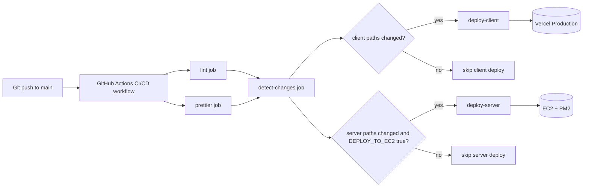
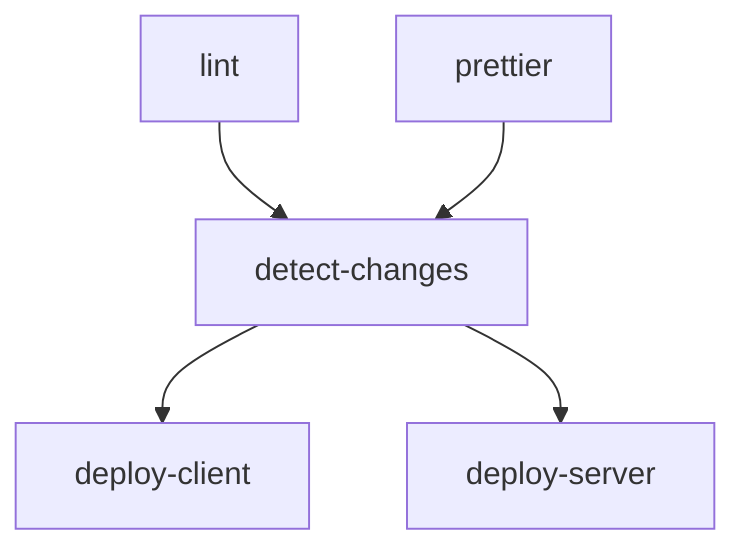
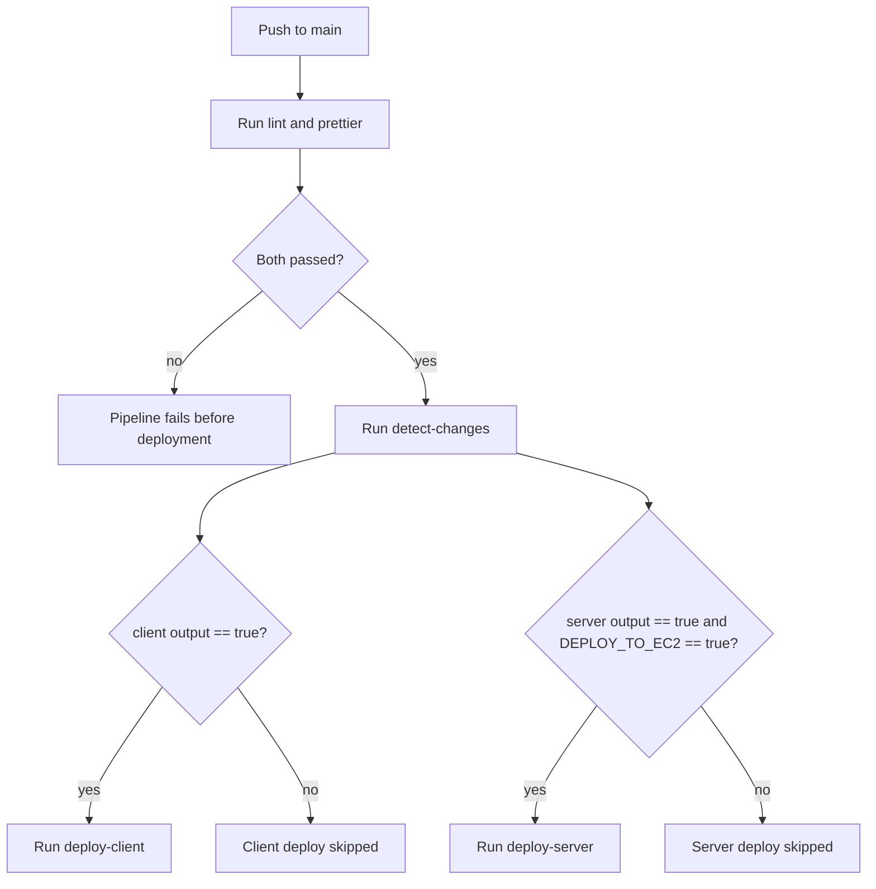
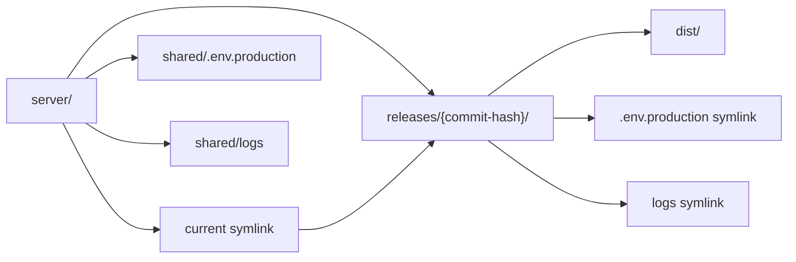
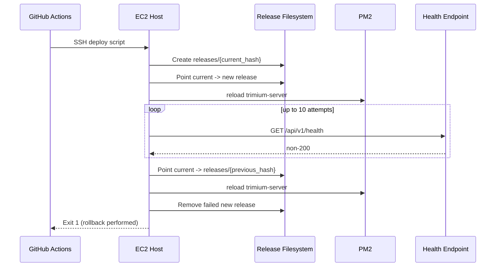
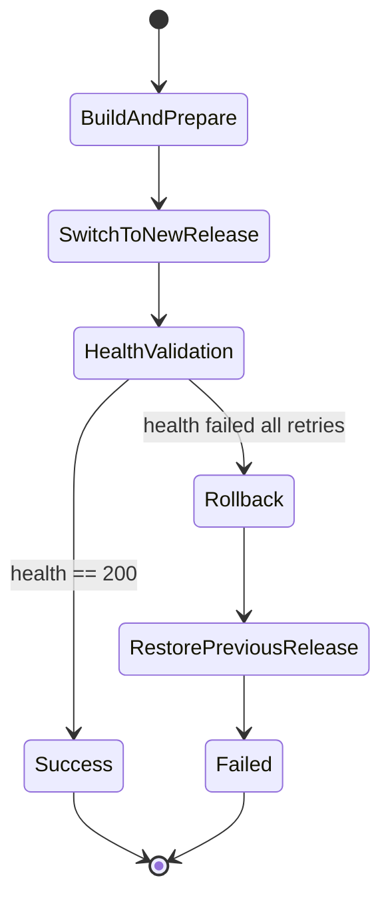

# Trimium CI/CD Pipeline Architecture

Source of truth:

- .github/workflows/ci.yml

This document explains the architecture and runtime behavior of Trimium's GitHub Actions CI/CD pipeline, including quality gates, change-aware deployment routing, Vercel client delivery, and EC2 server rollout with rollback protection.

## Overview

What this design demonstrates:

- Branch-gated delivery from a single production branch (`main`).
- Mandatory quality gates before any deployment path is evaluated.
- Monorepo-aware deployment selection using path filtering.
- Split deployment strategy by target platform:
  - client -> Vercel prebuilt production deploy.
  - server -> EC2 SSH orchestration with PM2 reload.
- Release safety for server deploys through health checks, automatic rollback, and release retention cleanup.

## Problem Context

Trimium contains two major deployable surfaces:

- `client/` for the Next.js frontend hosted on Vercel.
- `server/` for the API runtime hosted on EC2 behind PM2.

Without path-aware routing, every push to `main` would trigger both deployments, increasing risk and runtime cost. Without a rollback strategy, a bad server release could remain live until manual intervention. The workflow solves both concerns by:

- evaluating changed paths first,
- deploying only impacted surfaces,
- and enforcing health-based rollback on server rollout failure.

## Trigger and Scope

Workflow trigger:

- Event: `push`
- Branch: `main`

Implications:

- This pipeline is currently a production branch delivery pipeline.
- Pull request validation is not part of this workflow file.
- Every successful push to `main` can become a production release, gated by job conditions.

## High-Level Architecture

## Job Dependency Graph

Dependency semantics:

- `lint` and `prettier` run independently and in parallel.
- `detect-changes` waits for both quality jobs.
- Deployment jobs do not start unless:
  - quality gates pass,
  - `detect-changes` completes,
  - and their `if` conditions evaluate to true.

## End-to-End Decision Flow

## Detailed Job Breakdown

### `lint` Job

Purpose:

- Enforce static code quality before any release logic.

Runtime:

- Runner: `ubuntu-latest`

Execution steps:

1. Checkout repository state for the pushed commit.
2. Install pnpm tooling (`pnpm/action-setup@v5`).
3. Install Node.js 22 with pnpm cache enabled.
4. Install dependencies at repository root with lockfile strictness (`--frozen-lockfile`).
5. Execute `pnpm run lint`.

Why it matters architecturally:

- Prevents deployments on code that fails linting standards.
- Serves as an early, fast-failing gate to minimize wasted deploy effort.

Failure behavior:

- Any non-zero exit in lint steps fails the job.
- `detect-changes`, `deploy-client`, and `deploy-server` are blocked.

### `prettier` Job

Purpose:

- Enforce formatting consistency as a second quality gate.

Runtime:

- Runner: `ubuntu-latest`

Execution steps:

1. Checkout repository.
2. Setup pnpm.
3. Setup Node.js 22 with pnpm cache.
4. Install root dependencies with frozen lockfile.
5. Run `pnpm run format:check`.

Why it matters architecturally:

- Keeps style drift from entering production branch history.
- Makes release commits deterministic and easier to audit.

Failure behavior:

- Non-zero format check fails the job.
- Downstream `detect-changes` and deployment jobs do not run.

### `detect-changes` Job

Purpose:

- Compute deployment scope in a monorepo by detecting changed paths.

Runtime:

- Runner: `ubuntu-latest`
- Needs: `lint`, `prettier`

Execution steps:

1. Checkout repository.
2. Run `dorny/paths-filter@v4` with filters:
   - `client`: `client/**`
   - `server`: `server/**` and `package.json`
3. Publish outputs:
   - `client`: `steps.changes.outputs.client`
   - `server`: `steps.changes.outputs.server`

Architectural role:

- Acts as the control plane for selective CD.
- Decouples quality validation from deployment decisioning.
- Avoids unnecessary deploys for untouched surfaces.

Output contract:

| Output   | Meaning | Used by |
| -------- | ------- | ------- |
| `client` | Whether client-related paths changed | `deploy-client` condition |
| `server` | Whether server-related paths changed | `deploy-server` condition |

### `deploy-client` Job

Purpose:

- Build and deploy the frontend to Vercel production.

Runtime:

- Runner: `ubuntu-latest`
- Needs: `detect-changes`
- Condition: `needs.detect-changes.outputs.client == 'true'`

Execution steps:

1. Checkout repository.
2. Setup pnpm and Node.js 22.
3. Install Vercel CLI globally.
4. Pull production environment metadata using Vercel token.
5. Build prebuilt output with `vercel build --prod`.
6. Deploy prebuilt artifact with `vercel deploy --prebuilt --prod`.

Secrets and environment contract:

- `VERCEL_TOKEN`
- `VERCEL_ORG_ID`
- `VERCEL_PROJECT_ID`

Architectural role:

- Separates build and deploy phases while keeping them in one job.
- Uses Vercel-native build/deploy path for consistent production behavior.

Failure behavior:

- Any failure in pull/build/deploy ends the job with failure.
- Server deployment remains independent and may still run if its own condition is true.

### `deploy-server` Job

Purpose:

- Deploy backend changes to EC2 with health-validated release switching.

Runtime:

- Runner: `ubuntu-latest`
- Needs: `detect-changes`
- Condition: `needs.detect-changes.outputs.server == 'true' && vars.DEPLOY_TO_EC2 == 'true'`

Execution model:

- GitHub Actions triggers one SSH session using `appleboy/ssh-action@v1.0.3`.
- Remote host performs pull, build, release creation, symlink switch, process reload, health check, optional rollback, and cleanup.

### Server deploy script stages

1. Pre-flight shell safety
   - `set -e` for immediate failure on command errors.
   - Timestamped `log()` helper for traceable CI output.

2. Environment preparation
   - Load nvm (`source ~/.nvm/nvm.sh`).
   - Change directory to the server repo on EC2.

3. Source synchronization
   - `git pull origin main`.
   - Explicit guard: abort deployment if pull fails.

4. Dependency and build
   - Install root dependencies with frozen lockfile.
   - Install server dependencies with frozen lockfile.
   - Build server with constrained Node memory:
     - `NODE_OPTIONS="--max-old-space-size=1024" pnpm run build`
   - Refresh GeoIP data via root script (`pnpm run download:geoip`).

5. Release creation
   - Capture `CURRENT_HASH` from git.
   - Determine `PREVIOUS_HASH` from latest release directory timestamp.
   - Create new release directory: `server/releases/$CURRENT_HASH`.
   - Copy `dist` into release directory.
   - Remove old working `dist` directory.

6. Shared resource linking
   - Symlink `shared/.env.production` into new release.
   - Symlink `shared/logs` into new release.

7. Atomic traffic switch
   - Point `server/current` symlink to the new release (`ln -sfn`).
   - Reload process with `pm2 reload trimium-server`.

8. Health gate
   - Wait 3 seconds warm-up.
   - Probe `http://localhost:5000/api/v1/health` up to 10 times.
   - Each probe uses curl timeout (`--max-time 5`) and 5-second retry interval.

9. Success path
   - Mark deployment healthy.
   - Cleanup old releases, retaining 5 most recent.
   - Print PM2 process list and exit success.

10. Failure path
   - Trigger rollback block.
   - Restore `current` symlink to `PREVIOUS_HASH` if available.
   - Reload PM2 to restore previous code.
   - Delete failed new release directory.
   - Exit with failure.

## Server Release Topology

This is a symlink-based immutable release layout:

- Code artifacts are versioned by commit hash directories.
- Runtime pointer is a single mutable symlink (`current`).
- Shared mutable state (env/logs) is separated from versioned code.

## Server Deployment Strategy Explained

The backend rollout is not in-place overwrite. It is a staged release switch with safety checks:

1. Build first, switch later
   - New artifacts are prepared in a new release directory before changing runtime pointer.

2. Atomic pointer update
   - `ln -sfn` updates `current` to the new release in one operation from the filesystem perspective.

3. Zero-downtime intent via process reload
   - `pm2 reload` is used instead of full stop/start to reduce interruption risk.

4. Health-validated completion
   - Deployment is considered successful only when health endpoint returns HTTP 200.

5. Automatic rollback on health failure
   - If health checks never pass, pointer is switched back to last known release and PM2 is reloaded again.

6. Controlled disk growth
   - Old release directories are pruned, keeping only 5 latest.

Operationally, this approximates a lightweight rolling release pattern on a single host using immutable release folders plus runtime pointer switching.

## Rollback Mechanism Deep Dive

Rollback trigger condition:

- All health check attempts fail after reload of new release.

Rollback prerequisites:

- `PREVIOUS_HASH` must exist and map to a valid release directory.

Rollback actions:

1. Repoint `current` symlink to previous release directory.
2. Run `pm2 reload trimium-server`.
3. Delete failed new release directory.
4. Exit job as failed to preserve visibility in CI history.

If no valid previous release exists:

- Script logs a manual intervention error.
- Failed new release is still removed.
- Job exits failed.

### Rollback Sequence Diagram

### Deployment State Machine

### Time Window Before Rollback Decision

Approximate worst-case evaluation time before rollback decision:

$$
T_{max} \approx 3\text{s warmup} + 10 \times (5\text{s curl timeout} + 5\text{s retry delay}) = 103\text{s}
$$

In practice this is often lower because failed probes can return quicker than timeout.

## Conditions and Routing Matrix

| Job | Condition | Result if false |
| --- | --- | --- |
| `lint` | Always runs on `push` to `main` | Not applicable |
| `prettier` | Always runs on `push` to `main` | Not applicable |
| `detect-changes` | Runs only if `lint` and `prettier` pass | Pipeline stops before deployments |
| `deploy-client` | `detect-changes.outputs.client == 'true'` | Client deploy skipped |
| `deploy-server` | `detect-changes.outputs.server == 'true' && vars.DEPLOY_TO_EC2 == 'true'` | Server deploy skipped |

## Secrets, Variables, and Trust Boundaries

| Scope | Name | Purpose |
| ----- | ---- | ------- |
| GitHub Secret | `VERCEL_TOKEN` | Authenticate Vercel CLI actions |
| GitHub Secret | `VERCEL_ORG_ID` | Select Vercel org context |
| GitHub Secret | `VERCEL_PROJECT_ID` | Select Vercel project context |
| GitHub Secret | `EC2_HOST` | SSH target host |
| GitHub Secret | `EC2_USER` | SSH login user and remote path component |
| GitHub Secret | `EC2_PRIVATE_KEY` | SSH private key for remote execution |
| GitHub Variable | `DEPLOY_TO_EC2` | Feature flag to enable/disable server CD |

Trust boundary notes:

- GitHub-hosted runners execute CI logic.
- Deployment credentials are injected at runtime from GitHub secrets.
- Server deployment trusts remote EC2 environment (nvm, pnpm, PM2, filesystem layout).

## Failure Domains and Recovery Characteristics

Client deploy failure domain:

- Isolated to Vercel deployment job.
- Does not automatically affect server deployment.

Server deploy failure domain:

- Happens on remote host script execution.
- Automatic rollback protects runtime continuity when prior release exists.
- CI remains failed to ensure operational visibility.

Quality gate failure domain:

- Blocks all deployments early.
- Preserves production from unverified changes.

## Key Takeaways

This pipeline architecture shows practical release engineering maturity for a full-stack monorepo:

- Strong CI gates before CD starts.
- Change-aware deployment selection to reduce unnecessary releases.
- Platform-specific deployment workflows for frontend and backend.
- Backend release strategy with atomic switch, health gate, and rollback.
- Controlled retention of release history for stability and disk hygiene.
