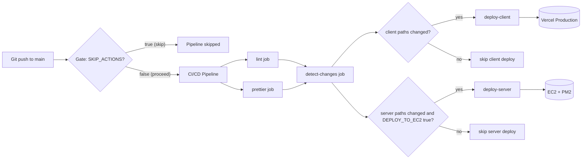
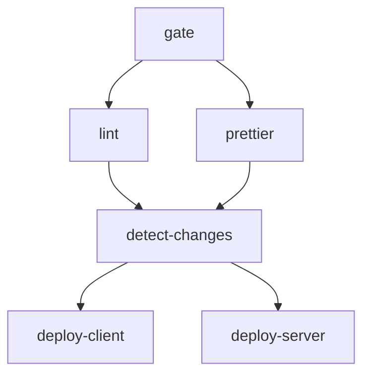
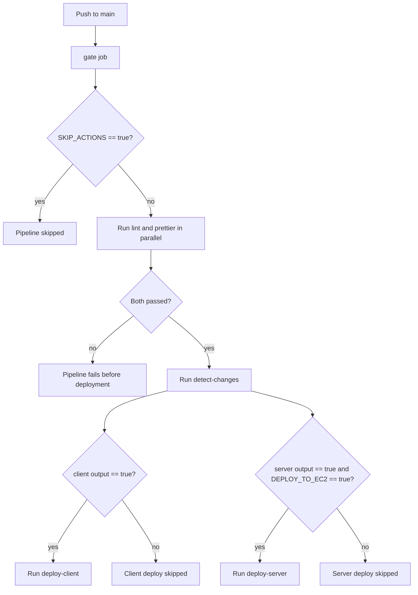
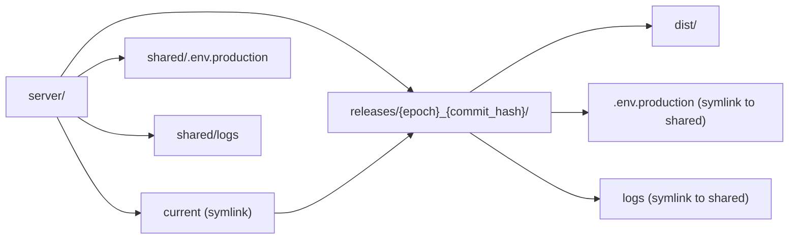
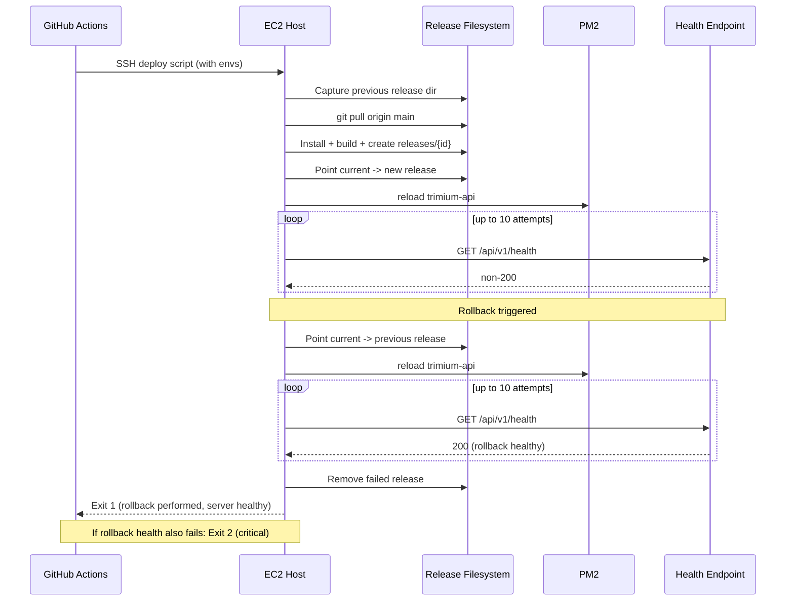
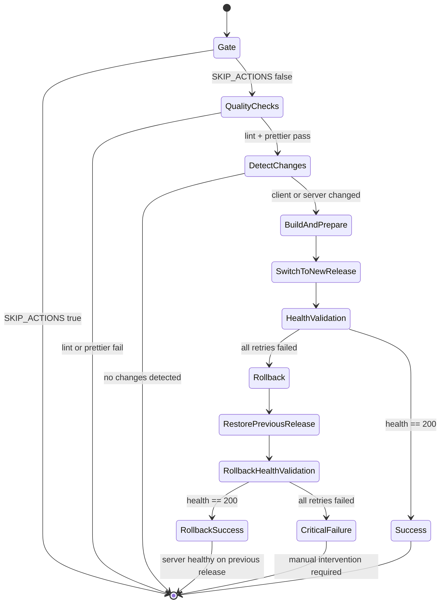

# Trimium CI/CD Pipeline Architecture

This document describes the architecture and runtime behavior of Trimium's GitHub Actions CI/CD pipeline, including its gating mechanism, quality checks, change-aware deployment routing, Vercel client delivery, and EC2 server rollout with health-validated rollback protection.

---

## Overview

The pipeline is built around these design principles:

- **Branch-gated delivery** from a single production branch (`main`)
- **Skip gate** via `SKIP_ACTIONS` variable to pause pipeline execution when needed
- **Mandatory quality gates** (lint + format) before any deployment path is evaluated
- **Monorepo-aware deployment selection** using path filtering via `dorny/paths-filter`
- **Split deployment strategy** by target platform:
  - client → Vercel prebuilt production deploy
  - server → EC2 SSH orchestration with PM2 reload and health-validated release switching
- **Release safety** through health checks, automatic rollback, and release retention cleanup

```mermaid
flowchart LR
    A[Git push to main] --> B{Gate: SKIP_ACTIONS?}
    B -- "true (skip)" --> Z[Pipeline skipped]
    B -- "false (proceed)" --> C[CI/CD Pipeline]

    C --> D[lint job]
    C --> E[prettier job]

    D --> F[detect-changes job]
    E --> F

    F --> G{client paths changed?}
    F --> H{server paths changed and DEPLOY_TO_EC2 true?}

    G -- yes --> I[deploy-client]
    G -- no --> J[skip client deploy]

    H -- yes --> K[deploy-server]
    H -- no --> L[skip server deploy]

    I --> M[(Vercel Production)]
    K --> N[(EC2 + PM2)]
```

---

## Job Dependency Graph

```mermaid
flowchart TD
    A[gate] --> B[lint]
    A --> C[prettier]

    B --> D[detect-changes]
    C --> D

    D --> E[deploy-client]
    D --> F[deploy-server]
```

Dependency semantics:

- `gate` runs first and conditionally gates all downstream jobs
- `lint` and `prettier` run in parallel after `gate`
- `detect-changes` waits for both quality jobs
- Deployment jobs wait for `detect-changes` and only run if their path conditions are met

---

## End-to-End Decision Flow

```mermaid
flowchart TD
    A[Push to main] --> B[gate job]
    B --> C{SKIP_ACTIONS == true?}
    C -- yes --> D[Pipeline skipped]
    C -- no --> E[Run lint and prettier in parallel]

    E --> F{Both passed?}
    F -- no --> G[Pipeline fails before deployment]
    F -- yes --> H[Run detect-changes]

    H --> I{client output == true?}
    H --> J{server output == true and DEPLOY_TO_EC2 == true?}

    I -- yes --> K[Run deploy-client]
    I -- no --> L[Client deploy skipped]

    J -- yes --> M[Run deploy-server]
    J -- no --> N[Server deploy skipped]
```

---

## Detailed Job Breakdown

### `gate` Job

Purpose:

- Control gate to allow skipping the entire pipeline via a GitHub Actions variable.

| Property | Value |
|---|---|
| Runner | `ubuntu-latest` |
| Condition | `vars.SKIP_ACTIONS != 'true'` |
| Steps | Single echo confirmation |

Why it matters architecturally:

- Provides an emergency brake to halt all CI/CD activity without modifying the workflow file or branch protection rules.
- All downstream jobs declare `needs: [gate]`, making the gate a true root dependency.

Failure behavior:

- If `SKIP_ACTIONS` is `'true'`, the gate is skipped and no downstream jobs execute.

### `lint` Job

Purpose:

- Enforce static code quality before any release logic.

| Property | Value |
|---|---|
| Runner | `ubuntu-latest` |
| Needs | `gate` |

Execution steps:

1. Checkout repository state for the pushed commit
2. Install pnpm tooling (`pnpm/action-setup@v5`)
3. Install Node.js 22 with pnpm cache enabled
4. Install dependencies at repository root with lockfile strictness (`--frozen-lockfile`)
5. Execute `pnpm run lint`

Failure behavior:

- Any non-zero exit fails the job
- `detect-changes`, `deploy-client`, and `deploy-server` are blocked

### `prettier` Job

Purpose:

- Enforce formatting consistency as a second quality gate.

| Property | Value |
|---|---|
| Runner | `ubuntu-latest` |
| Needs | `gate` |

Execution steps:

1. Checkout repository
2. Setup pnpm
3. Setup Node.js 22 with pnpm cache
4. Install root dependencies with frozen lockfile
5. Run `pnpm run format:check`

Failure behavior:

- Non-zero format check fails the job
- Downstream `detect-changes` and deployment jobs do not run

### `detect-changes` Job

Purpose:

- Compute deployment scope in a monorepo by detecting changed paths.

| Property | Value |
|---|---|
| Runner | `ubuntu-latest` |
| Needs | `lint`, `prettier` |

Execution steps:

1. Checkout repository
2. Run `dorny/paths-filter@v4` with filters:
   - `client`: `client/**`
   - `server`: `server/**` and `package.json`
3. Publish outputs: `steps.changes.outputs.client` and `steps.changes.outputs.server`

Output contract:

| Output | Meaning | Used by |
|---|---|---|
| `client` | Whether client-related paths changed | `deploy-client` condition |
| `server` | Whether server-related paths changed | `deploy-server` condition |

### `deploy-client` Job

Purpose:

- Build and deploy the frontend to Vercel production.

| Property | Value |
|---|---|
| Runner | `ubuntu-latest` |
| Needs | `detect-changes` |
| Condition | `needs.detect-changes.outputs.client == 'true'` |

Execution steps:

1. Checkout repository
2. Setup pnpm and Node.js 22
3. Install Vercel CLI globally
4. Pull production environment metadata using Vercel token and org/project IDs
5. Build prebuilt output with `vercel build --prod`
6. Deploy prebuilt artifact with `vercel deploy --prebuilt --prod`

Secrets and environment contract:

| Secret | Env passed to step | Purpose |
|---|---|---|
| `VERCEL_TOKEN` | — | Authenticate Vercel CLI |
| `VERCEL_ORG_ID` | `VERCEL_ORG_ID` | Select Vercel org context |
| `VERCEL_PROJECT_ID` | `VERCEL_PROJECT_ID` | Select Vercel project context |

Failure behavior:

- Any failure in pull/build/deploy ends the job with failure
- Server deployment remains independent and may still run

### `deploy-server` Job

Purpose:

- Deploy backend changes to EC2 with health-validated release switching.

| Property | Value |
|---|---|
| Runner | `ubuntu-latest` |
| Needs | `detect-changes` |
| Condition | `needs.detect-changes.outputs.server == 'true' && vars.DEPLOY_TO_EC2 == 'true'` |

Execution model:

- GitHub Actions triggers a single SSH session using `appleboy/ssh-action@v1.0.3`
- Environment variables are passed via the `envs` parameter to make them available in the remote shell
- The remote host performs the full deployment lifecycle: pull, install, build, release creation, symlink switch, process reload, health check, optional rollback, and cleanup

Environment variables passed to the remote session:

| Variable | Value |
|---|---|
| `PROJECT_DIR` | `/projects/Trimium` |
| `SERVER_DIR` | `$PROJECT_DIR/server` |
| `RELEASES_DIR` | `$SERVER_DIR/releases` |
| `SHARED_DIR` | `$SERVER_DIR/shared` |
| `CURRENT_DIR` | `$SERVER_DIR/current` |
| `HEALTH_CHECK_URL` | `http://localhost:5003/api/v1/health` |
| `HEALTH_RETRY_COUNT` | `10` |
| `HEALTH_RETRY_INTERVAL` | `5` (seconds) |
| `PM2_APP_NAME` | `trimium-api` |
| `MAX_RELEASES_TO_KEEP` | `54` |

---

## Server Deploy Script Stages

### 1. Shell Safety and Timing

- `set -e` for immediate failure on command errors
- `trap ... EXIT` to log elapsed deployment time
- Timestamped `log()` helper for traceable CI output

### 2. Environment Preparation

- Load bash profile and nvm (`source ~/.nvm/nvm.sh`)
- Capture previous release before any changes occur by finding the last directory in `$RELEASES_DIR` by sort order

### 3. Source Synchronization

- `git pull origin main`
- Explicit guard: abort deployment if pull fails

### 4. Dependency Installation and Build

- Install root dependencies with frozen lockfile
- Install server dependencies with frozen lockfile
- Build server with `pnpm run build`
- Download GeoIP database via `pnpm run download:geoip`

### 5. Release Creation

- Capture `GIT_HASH` and `EPOCH` timestamp
- Create release identifier: `{EPOCH}_{GIT_HASH}`
- Create release directory: `$RELEASES_DIR/$RELEASE_ID`
- Move compiled `dist/` into the release directory
- Symlink shared resources into the release:
  - `$SHARED_DIR/logs` → `$RELEASE_DIR/logs`
  - `$SHARED_DIR/.env.production` → `$RELEASE_DIR/.env.production`

### 6. Atomic Traffic Switch

- Point `$CURRENT_DIR` symlink to the new release: `ln -sfn "$RELEASE_DIR" "$CURRENT_DIR"`
- Reload process with `pm2 reload "$PM2_APP_NAME"`

### 7. Health Gate

- Probe `$HEALTH_CHECK_URL` up to `$HEALTH_RETRY_COUNT` times
- Each probe uses `curl --max-time 5` with `$HEALTH_RETRY_INTERVAL` seconds between attempts
- A single HTTP 200 response is considered healthy

### 8. Success Path

- Log successful deployment
- Cleanup old releases: sort directories, keep `$MAX_RELEASES_TO_KEEP` most recent, remove the rest
- Print PM2 process list and exit with code 0

### 9. Rollback Path

- If a previous release exists and is a valid directory:
  - Restore `$CURRENT_DIR` symlink to `$PREVIOUS_RELEASE`
  - Reload PM2 to restore previous code
  - Run a **second health check loop** to verify the rollback was successful
  - If rollback health passes: delete the failed release, exit with code 1
  - If rollback health also fails: exit with code 2 (critical — server may be down)
- If no previous release exists: exit with code 2 (critical)

---

## Release Topology

```mermaid
flowchart LR
    A["server/"] --> B["releases/{epoch}_{commit_hash}/"]
    A --> C["current (symlink)"]
    A --> D["shared/.env.production"]
    A --> E["shared/logs"]

    B --> F["dist/"]
    B --> G[".env.production (symlink to shared)"]
    B --> H["logs (symlink to shared)"]

    C --> B
```

This is a symlink-based immutable release layout:

- Code artifacts are versioned by timestamped commit hash directories
- Runtime pointer is a single mutable symlink (`current`)
- Shared mutable state (env, logs) is separated from versioned code

---

## Rollback Mechanism

Rollback trigger:

- All health check attempts fail after reload of the new release

Rollback prerequisites:

- `PREVIOUS_RELEASE` must exist as a valid directory

Rollback actions:

1. Repoint `current` symlink to the previous release directory
2. Run `pm2 reload trimium-api`
3. Run a second health check loop against the restored release
4. If rollback health passes: delete the failed release, exit with code 1
5. If rollback health fails: exit with code 2 (critical state — manual intervention required)
6. If no valid previous release exists: exit with code 2

```mermaid
sequenceDiagram
    participant GH as GitHub Actions
    participant EC2 as EC2 Host
    participant FS as Release Filesystem
    participant PM2 as PM2
    participant API as Health Endpoint

    GH->>EC2: SSH deploy script (with envs)
    EC2->>FS: Capture previous release dir
    EC2->>FS: git pull origin main
    EC2->>FS: Install + build + create releases/{id}
    EC2->>FS: Point current -> new release
    EC2->>PM2: reload trimium-api

    loop up to 10 attempts
        EC2->>API: GET /api/v1/health
        API-->>EC2: non-200
    end

    Note over EC2,API: Rollback triggered

    EC2->>FS: Point current -> previous release
    EC2->>PM2: reload trimium-api

    loop up to 10 attempts
        EC2->>API: GET /api/v1/health
        API-->>EC2: 200 (rollback healthy)
    end

    EC2->>FS: Remove failed release
    EC2-->>GH: Exit 1 (rollback performed, server healthy)

    Note over EC2,GH: If rollback health also fails: Exit 2 (critical)
```

### State Machine

```mermaid
stateDiagram-v2
    [*] --> Gate
    Gate --> QualityChecks: SKIP_ACTIONS false
    Gate --> [*]: SKIP_ACTIONS true

    QualityChecks --> DetectChanges: lint + prettier pass
    QualityChecks --> [*]: lint or prettier fail

    DetectChanges --> BuildAndPrepare: client or server changed
    DetectChanges --> [*]: no changes detected

    BuildAndPrepare --> SwitchToNewRelease
    SwitchToNewRelease --> HealthValidation

    HealthValidation --> Success: health == 200
    HealthValidation --> Rollback: all retries failed

    Rollback --> RestorePreviousRelease
    RestorePreviousRelease --> RollbackHealthValidation

    RollbackHealthValidation --> RollbackSuccess: health == 200
    RollbackHealthValidation --> CriticalFailure: all retries failed

    RollbackSuccess --> [*]: server healthy on previous release
    CriticalFailure --> [*]: manual intervention required

    Success --> [*]
```

---

## Conditions and Routing Matrix

| Job | Condition | Result if false |
|---|---|---|
| `gate` | Always runs (implicit) | Not applicable |
| `lint` | Needs `gate` | Skipped if gate skipped |
| `prettier` | Needs `gate` | Skipped if gate skipped |
| `detect-changes` | Needs `lint` and `prettier` | Pipeline stops before deployments |
| `deploy-client` | `detect-changes.outputs.client == 'true'` | Client deploy skipped |
| `deploy-server` | `detect-changes.outputs.server == 'true' && vars.DEPLOY_TO_EC2 == 'true'` | Server deploy skipped |

---

## Secrets, Variables, and Trust Boundaries

| Scope | Name | Purpose |
|---|---|---|
| GitHub Secret | `VERCEL_TOKEN` | Authenticate Vercel CLI actions |
| GitHub Secret | `VERCEL_ORG_ID` | Select Vercel org context |
| GitHub Secret | `VERCEL_PROJECT_ID` | Select Vercel project context |
| GitHub Secret | `EC2_HOST` | SSH target host |
| GitHub Secret | `EC2_USER` | SSH login user |
| GitHub Secret | `EC2_PRIVATE_KEY` | SSH private key for remote execution |
| GitHub Variable | `DEPLOY_TO_EC2` | Feature flag to enable/disable server CD |
| GitHub Variable | `SKIP_ACTIONS` | Emergency brake to skip the entire pipeline |

Trust boundary notes:

- GitHub-hosted runners execute CI logic
- Deployment credentials are injected at runtime from GitHub secrets
- Server deployment trusts the remote EC2 environment (nvm, pnpm, PM2, filesystem layout)
- SSH environment variables (`PROJECT_DIR`, `SERVER_DIR`, etc.) are declared inline in the workflow, not stored as secrets

---

## Failure Domains and Recovery Characteristics

| Failure Domain | Recovery |
|---|---|
| Quality gate failure (lint/format) | Blocks all deployments; preserves production |
| Client deploy failure | Isolated to Vercel job; server deploy unaffected |
| Server deploy failure (health fails) | Automatic rollback to previous release + rollback health verification |
| Server deploy failure (no prior release) | Exit code 2 — critical, manual intervention required |
| Rollback health failure | Exit code 2 — server may be down, manual intervention required |
| Skip gate active | Entire pipeline halted; no jobs execute |

---

## Key Takeaways

This pipeline demonstrates practical release engineering for a full-stack monorepo:

- **Emergency skip gate** provides a way to halt all CI/CD without modifying the workflow
- **Strong CI gates** before CD — both linting and formatting must pass
- **Change-aware deployment selection** reduces unnecessary releases for untouched surfaces
- **Platform-specific deployment workflows** — Vercel for frontend, EC2 SSH orchestration for backend
- **Immutable release directories** with timestamped commit hashes for traceability
- **Atomic symlink switch** enables near-instantaneous traffic migration
- **Health-validated rollout** with automatic rollback and rollback health verification
- **Controlled release retention** (54 releases kept) balances history depth with disk hygiene
