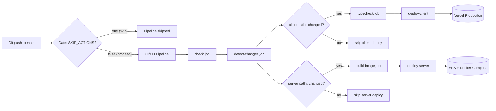
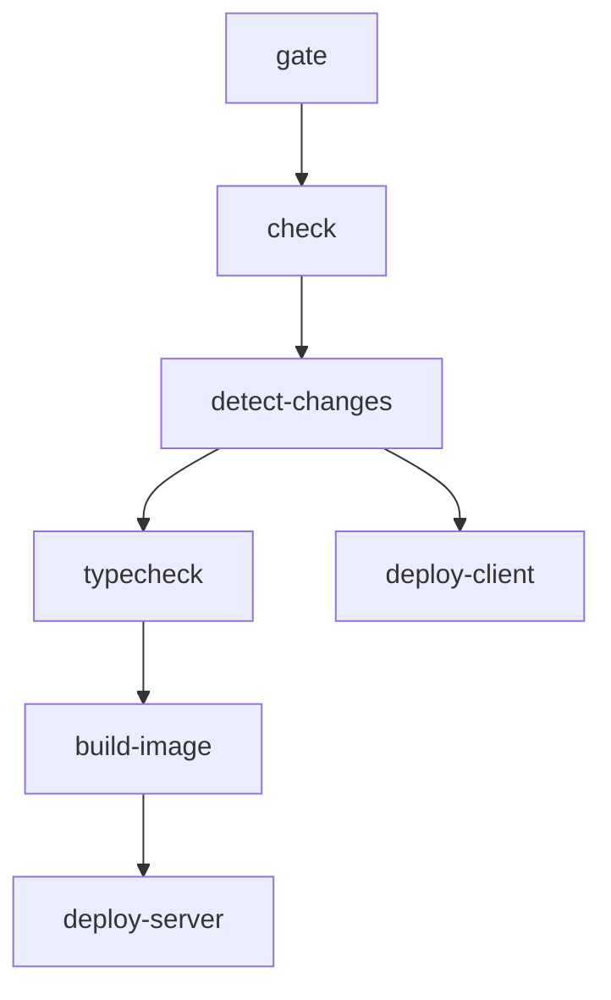
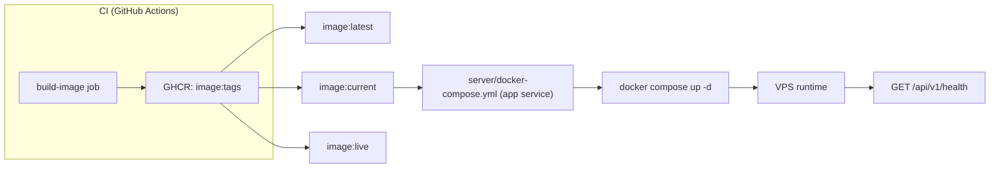
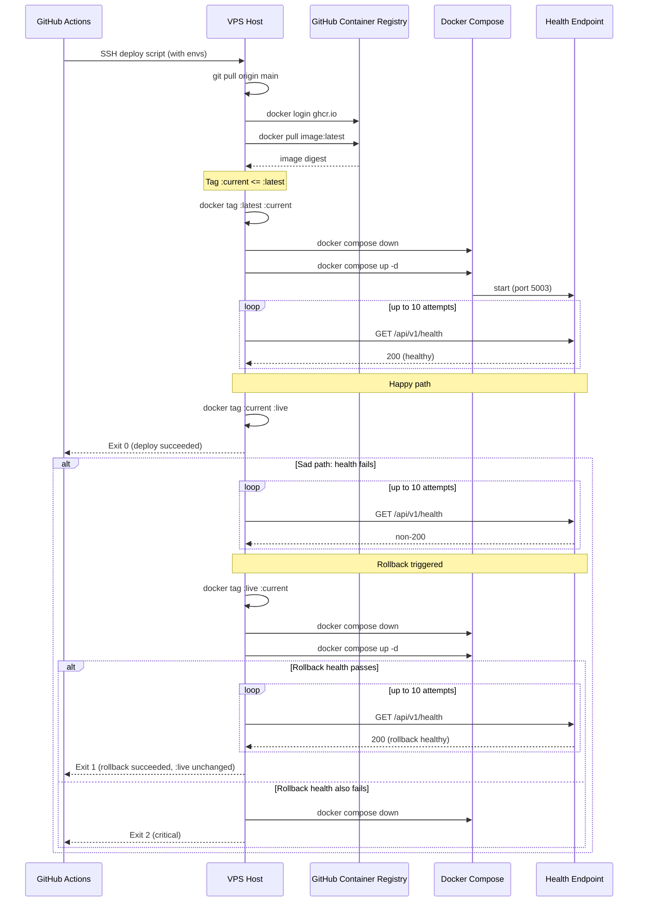
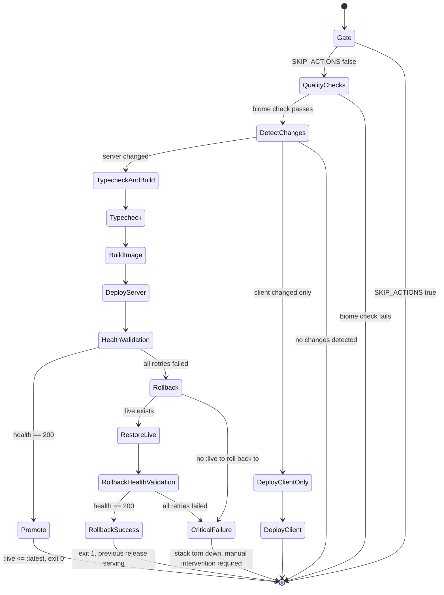

# Trimium CI/CD Pipeline Architecture

This document describes the architecture and runtime behavior of Trimium's GitHub Actions CI/CD pipeline, including its gating mechanism, quality checks, change-aware deployment routing, Vercel client delivery, and VPS server rollout via a container-image tag dance with health-validated rollback protection.

---

## Overview

The pipeline is built around these design principles:

- **Branch-gated delivery** from a single production branch (`main`)
- **Skip gate** via `SKIP_ACTIONS` variable to pause pipeline execution when needed
- **Mandatory quality gates** (Biome lint + format) before any deployment path is evaluated
- **Monorepo-aware deployment selection** using path filtering via `dorny/paths-filter`
- **Split deployment strategy** by target platform:
    - client → Vercel prebuilt production deploy
    - server → multi-stage Docker image built, pushed to GHCR, and rolled out on a VPS via `docker compose`
- **Release safety** through a three-image tag dance (`:latest` / `:current` / `:live`) and a health-checked rollback path

```mermaid
flowchart LR
    A[Git push to main] --> B{Gate: SKIP_ACTIONS?}
    B -- "true (skip)" --> Z[Pipeline skipped]
    B -- "false (proceed)" --> C[CI/CD Pipeline]

    C --> D[check job]

    D --> E[detect-changes job]

    E --> F{client paths changed?}
    E --> G{server paths changed?}

    F -- yes --> H[typecheck job]
    F -- no --> I[skip client deploy]

    H --> J[deploy-client]
    J --> K[(Vercel Production)]

    G -- yes --> L[build-image job]
    G -- no --> M[skip server deploy]

    L --> N[deploy-server]
    N --> O[(VPS + Docker Compose)]
```

---

## Job Dependency Graph

```mermaid
flowchart TD
    A[gate] --> B[check]

    B --> C[detect-changes]

    C --> D[typecheck]
    C --> E[deploy-client]

    D --> F[build-image]

    F --> G[deploy-server]
```

Dependency semantics:

- `gate` runs first and conditionally gates all downstream jobs
- `check` runs Biome linting and formatting verification
- `detect-changes` waits for `check` to pass before computing deployment scope
- `typecheck` runs only when server paths changed (concurrent with `deploy-client`)
- `deploy-client` runs in parallel with the server-side path (`typecheck` → `build-image` → `deploy-server`)
- `build-image` runs after `typecheck` and before `deploy-server`; it pushes the production image to GHCR

---

## End-to-End Decision Flow

```mermaid
flowchart TD
    A[Push to main] --> B[gate job]
    B --> C{SKIP_ACTIONS == true?}
    C -- yes --> D[Pipeline skipped]
    C -- no --> E[Run biome check (lint + format)]

    E --> F{Check passed?}
    F -- no --> G[Pipeline fails before deployment]
    F -- yes --> H[Run detect-changes]

    H --> I{client output == true?}
    H --> J{server output == true?}

    I -- yes --> K[Run typecheck]
    I -- no --> L[Client deploy skipped]

    K --> M[Run deploy-client]
    J -- yes --> N[Run build-image]
    J -- no --> O[Server deploy skipped]

    N --> P[Run deploy-server]
```

---

## Detailed Job Breakdown

### `gate` Job

Purpose:

- Control gate to allow skipping the entire pipeline via a GitHub Actions variable.

| Property  | Value                         |
| --------- | ----------------------------- |
| Runner    | `ubuntu-latest`               |
| Condition | `vars.SKIP_ACTIONS != 'true'` |
| Steps     | Single echo confirmation      |

Why it matters architecturally:

- Provides an emergency brake to halt all CI/CD activity without modifying the workflow file or branch protection rules.
- All downstream jobs declare `needs: [gate]`, making the gate a true root dependency.

Failure behavior:

- If `SKIP_ACTIONS` is `'true'`, the gate is skipped and no downstream jobs execute.

### `check` Job

Purpose:

- Enforce code quality (linting and formatting) before any release logic.

| Property | Value           |
| -------- | --------------- |
| Runner   | `ubuntu-latest` |
| Needs    | `gate`          |

Execution steps:

1. Checkout repository state for the pushed commit
2. Setup Bun (`oven-sh/setup-bun@v2`, version `1.4.0`)
3. Install root dependencies with frozen lockfile (`bun install --frozen-lockfile`)
4. Execute `bun run check` — runs `biome lint .` and `biome format --check .` in sequence

Failure behavior:

- Any non-zero exit fails the job
- `detect-changes`, `typecheck`, `deploy-client`, `build-image`, and `deploy-server` are blocked

### `detect-changes` Job

Purpose:

- Compute deployment scope in a monorepo by detecting changed paths.

| Property | Value              |
| -------- | ------------------ |
| Runner   | `ubuntu-latest`    |
| Needs    | `check`            |

Execution steps:

1. Checkout repository
2. Run `dorny/paths-filter@v4` with filters:
    - `client`: `client/**`
    - `server`: `server/**` and `package.json`
3. Publish outputs: `steps.changes.outputs.client` and `steps.changes.outputs.server`

Output contract:

| Output   | Meaning                              | Used by                          |
| -------- | ------------------------------------ | -------------------------------- |
| `client` | Whether client-related paths changed | `deploy-client` condition        |
| `server` | Whether server-related paths changed | `typecheck`, `build-image`, `deploy-server` conditions |

### `typecheck` Job

Purpose:

- Run TypeScript type checking on the server when server paths have changed.

| Property  | Value                                               |
| --------- | --------------------------------------------------- |
| Runner    | `ubuntu-latest`                                     |
| Needs     | `detect-changes`                                    |
| Condition | `needs.detect-changes.outputs.server == 'true'`     |

Execution steps:

1. Checkout repository
2. Setup Bun (`oven-sh/setup-bun@v2`, version `1.4.0`)
3. Install server dependencies with frozen lockfile (`bun install --frozen-lockfile --ignore-scripts`)
4. Run `bun run typecheck` (`tsc --noEmit`)

Failure behavior:

- Type errors fail the job and block `build-image` and `deploy-server`. `deploy-client` is unaffected.

### `deploy-client` Job

Purpose:

- Build and deploy the frontend to Vercel production.

| Property  | Value                                           |
| --------- | ----------------------------------------------- |
| Runner    | `ubuntu-latest`                                 |
| Needs     | `detect-changes`                                |
| Condition | `needs.detect-changes.outputs.client == 'true'` |

Execution steps:

1. Checkout repository
2. Setup Bun
3. Install Vercel CLI globally via Bun (`bun add -g vercel`)
4. Pull production environment metadata using Vercel token and org/project IDs
5. Build prebuilt output with `vercel build --prod`
6. Deploy prebuilt artifact with `vercel deploy --prebuilt --prod`

Secrets and environment contract:

| Secret              | Env passed to step  | Purpose                       |
| ------------------- | ------------------- | ----------------------------- |
| `VERCEL_TOKEN`      | —                   | Authenticate Vercel CLI       |
| `VERCEL_ORG_ID`     | `VERCEL_ORG_ID`     | Select Vercel org context     |
| `VERCEL_PROJECT_ID` | `VERCEL_PROJECT_ID` | Select Vercel project context |

Failure behavior:

- Any failure in pull/build/deploy ends the job with failure
- Server deployment remains independent and may still run

### `build-image` Job

Purpose:

- Build the production server image (multi-stage Docker build using `oven/bun:1-alpine`) and push it to GitHub Container Registry.

| Property    | Value                                           |
| ----------- | ----------------------------------------------- |
| Runner      | `ubuntu-latest`                                 |
| Needs       | `typecheck`                                     |
| Condition   | `needs.detect-changes.outputs.server == 'true'` |
| Permissions | `contents: read`, `packages: write`             |

Execution steps:

1. Checkout repository
2. Set up Docker Buildx (`docker/setup-buildx-action@v3`)
3. Log in to GHCR (`docker/login-action@v3`) using `github.actor` and `GITHUB_TOKEN`
4. Build and push the image with `docker/build-push-action@v6`:
    - `context: ./server`
    - `push: true`
    - `tags: ghcr.io/iamdevtrivedi/trimium-app:latest`
    - `cache-from: type=gha` and `cache-to: type=gha,mode=max` for GitHub Actions cache acceleration

The image produced is the single source of truth for the server release: a layered, reproducible artifact built from the current `server/Dockerfile`. The `:latest` tag is overwritten on every successful build; downstream jobs and the VPS only ever read from GHCR.

Failure behavior:

- Build failure (compile, dependency install, Dockerfile error) fails the job and blocks `deploy-server`
- Push failure (auth, network, registry rejection) fails the job and blocks `deploy-server`

### `deploy-server` Job

Purpose:

- Pull the freshly built image from GHCR and roll it out on the VPS via a three-image tag dance with health-validated rollback.

| Property  | Value                                           |
| --------- | ----------------------------------------------- |
| Runner    | `ubuntu-latest`                                 |
| Needs     | `build-image`                                   |
| Condition | `needs.detect-changes.outputs.server == 'true'` |

Execution model:

- GitHub Actions triggers a single SSH session using `appleboy/ssh-action@v1.0.3`
- Environment variables are passed via the `envs` parameter to make them available in the remote shell
- The remote host performs the full deploy lifecycle: source pull, GHCR login, image pull, tag dance, `docker compose` rollout, health check, optional rollback

> [!NOTE]
> Server deployment is automatic whenever server paths change. There is no separate `DEPLOY_TO_VPS` gate.

Environment variables passed to the remote session:

| Variable                | Value                                 |
| ----------------------- | ------------------------------------- |
| `PROJECT_DIR`           | `/projects/Trimium`                   |
| `SERVER_DIR`            | `$PROJECT_DIR/server`                 |
| `HEALTH_CHECK_URL`      | `http://localhost:5003/api/v1/health` |
| `HEALTH_RETRY_COUNT`    | `10`                                  |
| `HEALTH_RETRY_INTERVAL` | `5` (seconds)                         |
| `IMAGE_BASE`            | `ghcr.io/iamdevtrivedi/trimium-app` |
| `LATEST_TAG`            | `${IMAGE_BASE}:latest`                |
| `CURRENT_TAG`           | `${IMAGE_BASE}:current`               |
| `LIVE_TAG`              | `${IMAGE_BASE}:live`                  |
| `GHCR_USER`             | `${{ github.actor }}`                 |
| `GHCR_TOKEN`            | `${{ secrets.GITHUB_TOKEN }}`         |

---

## Server Deploy Script Stages

### 1. Shell Safety and Timing

- `set -euo pipefail` for immediate failure on any error
- `trap ... EXIT` to log elapsed deployment time and final exit code
- Timestamped `log()` helper for traceable CI output

### 2. Source Synchronization

- `cd "$PROJECT_DIR"` then `git pull origin main`
- Explicit guard: abort deployment if `git pull` fails (compose files or env templates may have changed on the server)

### 3. GHCR Login and Image Pull

- `echo "$GHCR_TOKEN" | docker login ghcr.io -u "$GHCR_USER" --password-stdin`
- `docker pull "$LATEST_TAG"` (`:latest` is the artifact produced by `build-image`)
- Explicit guard: abort if the pull fails

### 4. Tag `:current` → `:latest`

- `docker tag "$LATEST_TAG" "$CURRENT_TAG"`

The production `server/docker-compose.yml` pins the `app` service to `:current`. Repointing `:current` to the freshly built image is what makes the next `docker compose up -d` deploy the new release.

### 5. Rollout `:current` via `docker compose`

- `cd "$SERVER_DIR"`
- `docker compose down` to stop the previously running stack
- `docker compose up -d` to start the stack against the new `:current` image
- The local `server/.env.production` is read by the container at startup

### 6. Health Gate

- Probe `$HEALTH_CHECK_URL` up to `HEALTH_RETRY_COUNT` (10) times
- Each probe uses `curl --max-time 5`
- A single HTTP 200 response is considered healthy
- Failed attempts wait `HEALTH_RETRY_INTERVAL` (5) seconds before the next probe

### 7. Happy Path — Promote `:current` to `:live`

- After the first health check loop passes:
    - `docker tag "$CURRENT_TAG" "$LIVE_TAG"` — `:live` is now the new release
- Log success and exit with code 0

### 8. Sad Path — Rollback to `:live`

- If the first health check loop fails and a `:live` image exists:
    - `docker tag "$LIVE_TAG" "$CURRENT_TAG"` — repoint `:current` to the previously known-good release
    - `docker compose down && docker compose up -d`
    - Run a second health check loop against the rolled-back release
        - If it passes: `:live` is left unchanged (the new build was bad), exit with code 1
        - If it fails: tear the stack down, exit with code 2 (critical — manual intervention required)
- If no `:live` image exists yet (first deploy or a previous rollback consumed it):
    - `docker compose down` and exit with code 2

Exit code contract:

| Exit code | Meaning                                                          | State after deploy                                       |
| --------- | ---------------------------------------------------------------- | -------------------------------------------------------- |
| `0`       | Happy path — new release is healthy                              | `:current` and `:live` both point at the new build       |
| `1`       | New release was bad; rollback succeeded                          | `:current` and `:live` both point at the previous build  |
| `2`       | Critical — new release was bad AND rollback also failed (or no `:live` to roll back to) | Stack torn down; manual intervention required           |

---

## Image Tag Topology

```mermaid
flowchart LR
    subgraph CI["CI (GitHub Actions)"]
        A[build-image job] --> B["GHCR: image:tags"]
    end

    B --> L["image:latest"]
    B --> C["image:current"]
    B --> V["image:live"]

    C --> D["server/docker-compose.yml (app service)"]

    D --> E[docker compose up -d]
    E --> F[VPS runtime]
    F --> G["GET /api/v1/health"]
```

The release layout is a **three-image tag dance in the registry**:

- `:latest` is the output of `build-image`; always points at the most recently built artifact
- `:current` is the tag pinned by `server/docker-compose.yml`; it is what the VPS actually runs
- `:live` is the last-known-good image; it is the rollback target and is only updated after a successful health check

Operational properties:

- **Single source of truth for the running release** is the `app` image in `server/docker-compose.yml` (`image: ...:current`). All rollout decisions are made by repointing tags, never by editing compose files mid-deploy.
- **Atomic migration** is achieved by retagging in GHCR (cheap, registry-side) and restarting the stack (idempotent — `docker compose down && up -d`).
- **Last-known-good is preserved across failed deploys** — `:live` is never overwritten until the new release has passed its health check.
- **Disk hygiene is delegated to the registry and to Docker** — no on-host `releases/{epoch}_{commit}/` directories or symlinks to manage.

---

## Rollback Mechanism

Rollback trigger:

- All health check attempts fail after `docker compose up -d` of the new release

Rollback prerequisites:

- A `:live` tag must exist in the local Docker image cache (it is pulled implicitly via `:latest` only on the first deploy; thereafter it is held by a previous successful deploy)

Rollback actions:

1. Repoint `:current` to `:live` (`docker tag "$LIVE_TAG" "$CURRENT_TAG"`)
2. Restart the stack: `docker compose down && docker compose up -d`
3. Run a second health check loop against the rolled-back release
4. If rollback health passes: `:live` is left unchanged; the failed build is "abandoned" (its `:latest` will be overwritten by the next `build-image`); exit with code 1
5. If rollback health also fails: tear the stack down (`docker compose down`); exit with code 2 (critical state — manual intervention required)
6. If no valid `:live` image exists to roll back to: tear the stack down; exit with code 2

```mermaid
sequenceDiagram
    participant GH as GitHub Actions
    participant VPS as VPS Host
    participant GHCR as GitHub Container Registry
    participant DC as Docker Compose
    participant API as Health Endpoint

    GH->>VPS: SSH deploy script (with envs)
    VPS->>VPS: git pull origin main
    VPS->>GHCR: docker login ghcr.io
    VPS->>GHCR: docker pull image:latest
    GHCR-->>VPS: image digest

    Note over VPS: Tag :current <= :latest
    VPS->>VPS: docker tag :latest :current

    VPS->>DC: docker compose down
    VPS->>DC: docker compose up -d
    DC->>API: start (port 5003)

    loop up to 10 attempts
        VPS->>API: GET /api/v1/health
        API-->>VPS: 200 (healthy)
    end

    Note over VPS,API: Happy path

    VPS->>VPS: docker tag :current :live
    VPS-->>GH: Exit 0 (deploy succeeded)

    alt Sad path: health fails
        loop up to 10 attempts
            VPS->>API: GET /api/v1/health
            API-->>VPS: non-200
        end

        Note over VPS,API: Rollback triggered

        VPS->>VPS: docker tag :live :current
        VPS->>DC: docker compose down
        VPS->>DC: docker compose up -d

        alt Rollback health passes
            loop up to 10 attempts
                VPS->>API: GET /api/v1/health
                API-->>VPS: 200 (rollback healthy)
            end
            VPS-->>GH: Exit 1 (rollback succeeded, :live unchanged)
        else Rollback health also fails
            VPS->>DC: docker compose down
            VPS-->>GH: Exit 2 (critical)
        end
    end
```

### State Machine

```mermaid
stateDiagram-v2
    [*] --> Gate
    Gate --> QualityChecks: SKIP_ACTIONS false
    Gate --> [*]: SKIP_ACTIONS true

    QualityChecks --> DetectChanges: biome check passes
    QualityChecks --> [*]: biome check fails

    DetectChanges --> TypecheckAndBuild: server changed
    DetectChanges --> DeployClientOnly: client changed only
    DetectChanges --> [*]: no changes detected

    DeployClientOnly --> DeployClient
    DeployClient --> [*]

    TypecheckAndBuild --> Typecheck
    Typecheck --> BuildImage
    BuildImage --> DeployServer
    DeployServer --> HealthValidation

    HealthValidation --> Promote: health == 200
    HealthValidation --> Rollback: all retries failed

    Promote --> [*]: :live <= :latest, exit 0

    Rollback --> RestoreLive: :live exists
    Rollback --> CriticalFailure: no :live to roll back to

    RestoreLive --> RollbackHealthValidation
    RollbackHealthValidation --> RollbackSuccess: health == 200
    RollbackHealthValidation --> CriticalFailure: all retries failed

    RollbackSuccess --> [*]: exit 1, previous release serving
    CriticalFailure --> [*]: stack torn down, manual intervention required
```

---

## Conditions and Routing Matrix

| Job              | Condition                                                   | Result if false                   |
| ---------------- | ----------------------------------------------------------- | --------------------------------- |
| `gate`           | Always runs (implicit)                                      | Not applicable                    |
| `check`          | Needs `gate`                                                | Skipped if gate skipped           |
| `detect-changes` | Needs `check`                                               | Pipeline stops before deployments |
| `typecheck`      | `detect-changes.outputs.server == 'true'`                   | Skipped if no server changes      |
| `deploy-client`  | `detect-changes.outputs.client == 'true'`                   | Client deploy skipped             |
| `build-image`    | `detect-changes.outputs.server == 'true'`                   | Skipped if no server changes      |
| `deploy-server`  | `detect-changes.outputs.server == 'true'`                   | Server deploy skipped             |

---

## Secrets, Variables, and Trust Boundaries

| Scope           | Name                | Purpose                                     |
| --------------- | ------------------- | ------------------------------------------- |
| GitHub Secret   | `VERCEL_TOKEN`      | Authenticate Vercel CLI actions             |
| GitHub Secret   | `VERCEL_ORG_ID`     | Select Vercel org context                   |
| GitHub Secret   | `VERCEL_PROJECT_ID` | Select Vercel project context               |
| GitHub Secret   | `SSH_HOST`          | SSH target host                             |
| GitHub Secret   | `SSH_USER`          | SSH login user                              |
| GitHub Secret   | `SSH_PRIVATE_KEY`   | SSH private key for remote execution        |
| GitHub Secret   | `GITHUB_TOKEN`      | Auto-provisioned; used for GHCR login + push |
| GitHub Variable | `SKIP_ACTIONS`      | Emergency brake to skip the entire pipeline |

Trust boundary notes:

- GitHub-hosted runners execute CI logic
- Deployment credentials are injected at runtime from GitHub secrets
- The `GITHUB_TOKEN` is used as both the GHCR login principal and the SSH session's `GHCR_TOKEN`; it grants the runner and the VPS scoped, time-bound access to the registry
- Server deployment trusts the remote VPS environment (Docker Engine, `docker compose`, filesystem layout, `server/.env.production` presence)
- Image tag names (`LATEST_TAG`, `CURRENT_TAG`, `LIVE_TAG`) and filesystem paths (`PROJECT_DIR`, `SERVER_DIR`) are declared inline in the workflow, not stored as secrets

---

## Failure Domains and Recovery Characteristics

| Failure Domain                           | Recovery                                                              |
| ---------------------------------------- | --------------------------------------------------------------------- |
| Quality gate failure (biome check)       | Blocks all deployments; preserves production                          |
| Typecheck failure                        | Blocks `build-image` and `deploy-server`; client deploy may still run  |
| Build-image failure                      | Blocks `deploy-server`; production stack is untouched                 |
| Deploy-server failure (health fails)     | Automatic rollback to `:live` + rollback health verification          |
| Deploy-server failure (no `:live` image) | Exit code 2 — critical, manual intervention required                  |
| Rollback health failure                  | Exit code 2 — server may be down, manual intervention required        |
| `git pull` failure on the VPS            | Abort before any image changes are made; production stack untouched   |
| `docker pull` failure on the VPS         | Abort before any tag changes are made; production stack untouched     |
| Skip gate active                         | Entire pipeline halted; no jobs execute                               |

---

## Key Takeaways

This pipeline demonstrates practical release engineering for a full-stack monorepo:

- **Emergency skip gate** provides a way to halt all CI/CD without modifying the workflow
- **Strong CI gates before CD** — Biome linting and formatting must both pass
- **TypeScript type checking** runs as a separate gate before the server image is built
- **Change-aware deployment selection** reduces unnecessary builds and deploys for untouched surfaces
- **Container-first server release** — the server is shipped as a single multi-stage image produced by `server/Dockerfile`; no on-host `dist/` or compiled bundle is required
- **Registry-based release topology** — the `:latest` / `:current` / `:live` tag dance gives the same operational guarantees as a symlink-based release layout (immutable artifact, atomic switch, last-known-good pointer) without the on-host filesystem choreography
- **Platform-specific deployment workflows** — Vercel for the frontend, GHCR + Docker Compose for the backend
- **Atomic tag-driven rollout** — `docker compose down && up -d` always runs the same compose file; only the image tag it points to changes
- **Health-validated rollout** with automatic rollback and rollback health verification
- **Disk hygiene is delegated** to GHCR and the local Docker image cache — no on-host release directories to retain or prune
