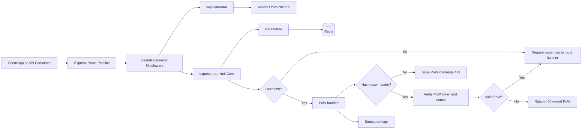
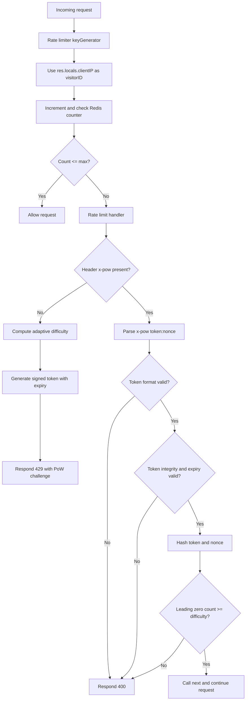
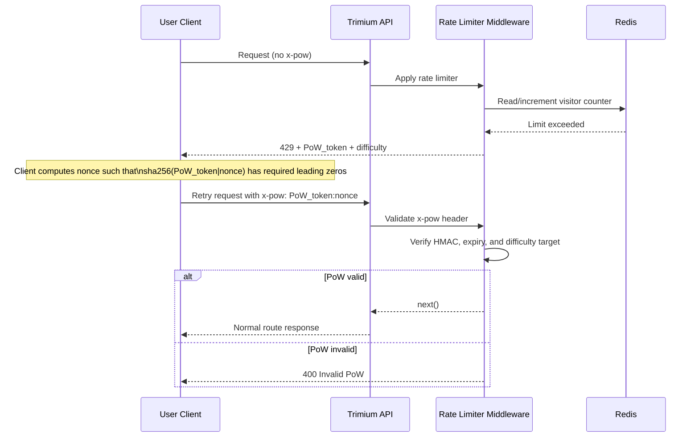
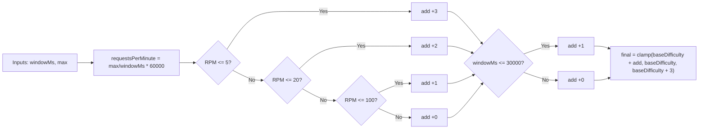

# Trimium Rate Limiter Architecture

Source of truth: server/src/middlewares/rateLimiter.ts

This document explains the architecture and runtime behavior of Trimium's Redis-backed rate limiter with a Proof of Work (PoW) fallback.

## Overview

What this design demonstrates:

- Production-aware rate limiting with Redis-backed counters.
- Fairness strategy for shared-IP enterprise traffic.
- Security-focused challenge integrity using HMAC.
- Adaptive throttling behavior based on endpoint pressure.
- Clear operational logging for abuse investigation.

## Problem Context

Traditional IP-based throttling works well for individual users, but it breaks down in organizations where many users share one outbound IP (NAT, corporate VPN, secure gateway).

In that situation, one heavy user can consume the entire shared IP quota and unintentionally block everyone else from the same organization.

The PoW trigger was added to reduce this blast radius: instead of hard-blocking every request after the limit, the system asks over-limit traffic to solve a short computational challenge.

## High-Level Architecture

## Request Decision Flow

## PoW Challenge-Response Sequence

## Adaptive Difficulty Model

## Why PoW Triggering Was Needed

In large workspaces, one IP can represent many human users.

Without PoW:

- One user spamming requests can saturate the shared IP quota.
- The whole organization behind that IP gets blocked together.
- Legitimate users experience hard failures even when their own behavior is normal.

With PoW fallback:

- Over-limit traffic is not blindly denied.
- Each additional request requires computational work.
- Legitimate users can still proceed by solving a bounded challenge.
- Abuse becomes expensive at scale because attacker cost increases quickly.

This changes throttling from a pure binary block into a fairness mechanism under contention.

## How PoW Solves Shared-IP Fairness

The middleware verifies a hash target where the SHA-256 digest must start with a number of hex zeros.

Expected work is approximately:

Expected attempts = 16^difficulty

| Difficulty | Approx expected attempts |
| ---------- | -----------------------: |
| 3          |                    4,096 |
| 4          |                   65,536 |
| 5          |                1,048,576 |
| 6          |               16,777,216 |

Impact:

- Small bursts remain practical for real users.
- Sustained abuse becomes computationally expensive.
- Shared-IP teams are less likely to be totally locked out by one noisy actor.

## Security and Integrity Notes

The PoW token includes:

- difficulty
- expiry timestamp
- random salt
- HMAC-SHA256 integrity signature (using PoW_SECRET)

This prevents client-side tampering with challenge parameters.

Validation path checks:

- x-pow header shape
- token decoding and field completeness
- expiry window
- HMAC integrity
- hash target satisfaction

## Implementation Mapping

Main components in rateLimiter.ts:

- calculateAdaptiveDifficulty(options): endpoint-sensitive challenge hardness.
- issuePoWChallenge(req, res, options): signs and emits challenge payload.
- verifyPoWAndRespond(req, res, next): validates PoW proof and forwards request.
- createRateLimiter({ windowMs, max, prefix }): reusable middleware factory.
- globalRateLimiter: default global policy at 1000 requests per minute.

Operational behavior:

- RedisStore keeps counters centralized across processes.
- keyGenerator binds visitorID to client IP from request locals.
- Handler logs over-limit events with prefix and policy metadata.

## Key Takeaways

This architecture highlights practical backend engineering strengths:

- Scalable throttling strategy for distributed deployments.
- Security-conscious token signing and validation.
- Fairness-aware design for real enterprise networking conditions.
- Composable middleware factory usable per route group.
- Strong observability through explicit rate-limit logs.
