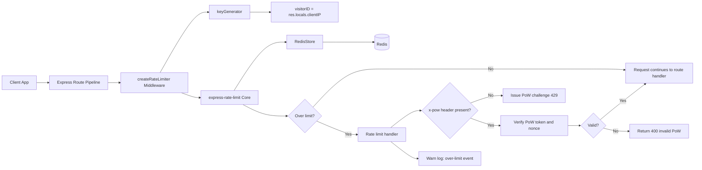
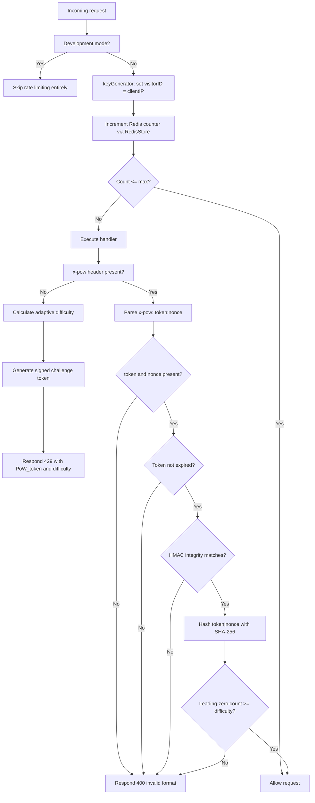
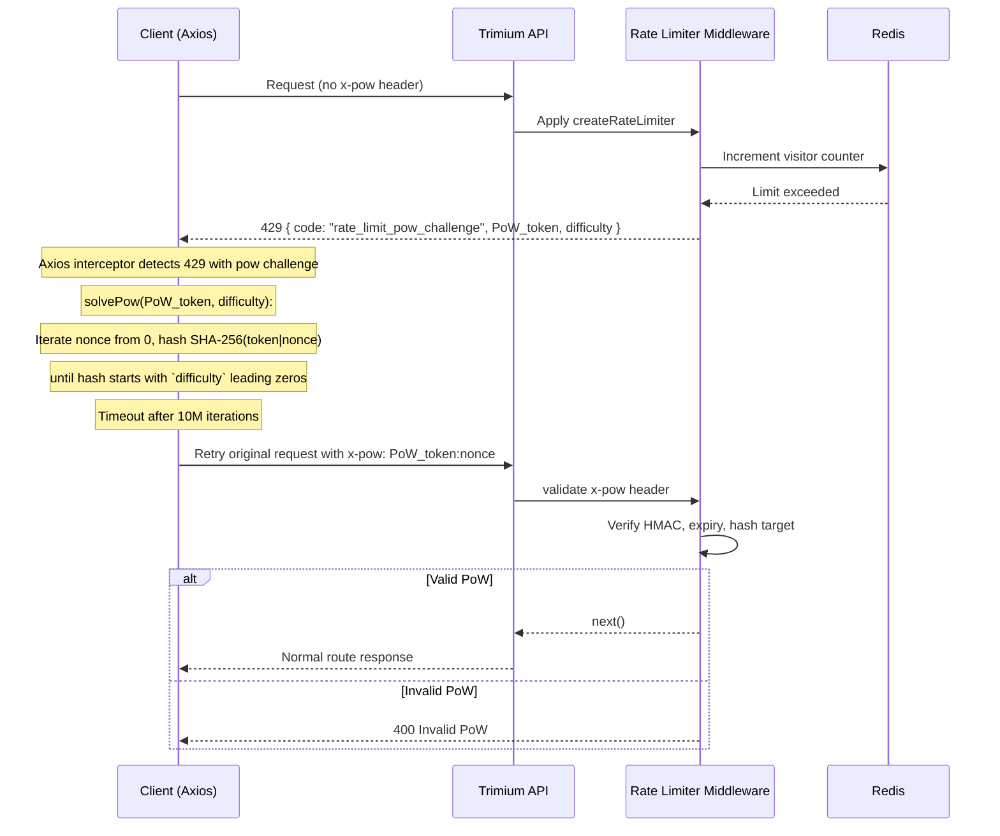
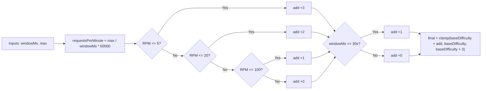
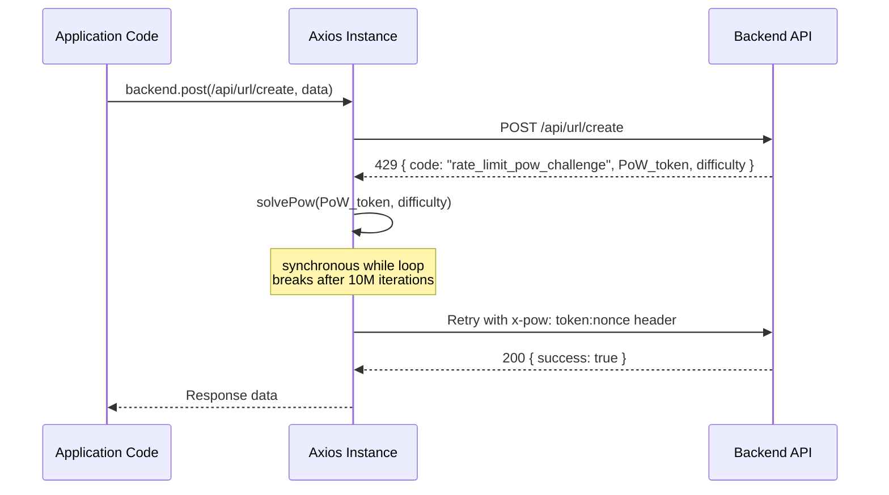

# Trimium Rate Limiter Architecture

This document describes the architecture and runtime behavior of Trimium's Redis-backed rate limiter with a Proof of Work (PoW) fallback, including the client-side PoW solver integrated into the Axios HTTP client.

---

## Overview

The rate limiting system is built around these design goals:

- **Production-aware rate limiting** with Redis-backed counters shared across processes
- **Development bypass** — rate limits are disabled in development (`max: Infinity`) for friction-free local testing
- **Fairness strategy** for shared-IP enterprise traffic via computational challenges instead of hard blocks
- **Adaptive difficulty** based on endpoint pressure — stricter endpoints get harder challenges
- **Security-focused challenge integrity** using HMAC-SHA256 to prevent token tampering
- **Standardized headers** using the `RateLimit-*` specification (`standardHeaders: true`)


```mermaid
flowchart LR
    A[Client App] --> B[Express Route Pipeline]
    B --> C[createRateLimiter Middleware]

    C --> D[keyGenerator]
    D --> E[visitorID = res.locals.clientIP]

    C --> F[express-rate-limit Core]
    F --> G[RedisStore]
    G --> H[(Redis)]

    F --> I{Over limit?}
    I -- No --> J[Request continues to route handler]
    I -- Yes --> K[Rate limit handler]

    K --> L{x-pow header present?}
    L -- No --> M[Issue PoW challenge 429]
    L -- Yes --> N[Verify PoW token and nonce]

    N --> O{Valid?}
    O -- Yes --> J
    O -- No --> P[Return 400 invalid PoW]

    K --> Q[Warn log: over-limit event]
```

---

## Request Decision Flow


```mermaid
flowchart TD
    A[Incoming request] --> B[Development mode?]
    B -- Yes --> Z[Skip rate limiting entirely]
    B -- No --> C[keyGenerator: set visitorID = clientIP]
    C --> D[Increment Redis counter via RedisStore]

    D --> E{Count <= max?}
    E -- Yes --> F[Allow request]
    E -- No --> G[Execute handler]

    G --> H[x-pow header present?]
    H -- No --> I[Calculate adaptive difficulty]
    I --> J[Generate signed challenge token]
    J --> K[Respond 429 with PoW_token and difficulty]

    H -- Yes --> L[Parse x-pow: token:nonce]
    L --> M{token and nonce present?}
    M -- No --> N[Respond 400 invalid format]
    M -- Yes --> O{Token not expired?}
    O -- No --> N
    O -- Yes --> P{HMAC integrity matches?}
    P -- No --> N
    P -- Yes --> Q["Hash token|nonce with SHA-256"]
    Q --> R{"Leading zero count >= difficulty?"}
    R -- No --> N
    R -- Yes --> F
```

---

## PoW Challenge-Response Sequence


```mermaid
sequenceDiagram
    participant U as Client (Axios)
    participant API as Trimium API
    participant RL as Rate Limiter Middleware
    participant REDIS as Redis

    U->>API: Request (no x-pow header)
    API->>RL: Apply createRateLimiter
    RL->>REDIS: Increment visitor counter
    REDIS-->>RL: Limit exceeded

    RL-->>U: 429 { code: "rate_limit_pow_challenge", PoW_token, difficulty }

    Note over U: Axios interceptor detects 429 with pow challenge
    Note over U: solvePow(PoW_token, difficulty):
    Note over U:   Iterate nonce from 0, hash SHA-256(token|nonce)
    Note over U:   until hash starts with `difficulty` leading zeros
    Note over U:   Timeout after 10M iterations

    U->>API: Retry original request with x-pow: PoW_token:nonce
    API->>RL: validate x-pow header
    RL->>RL: Verify HMAC, expiry, hash target

    alt Valid PoW
        RL-->>API: next()
        API-->>U: Normal route response
    else Invalid PoW
        RL-->>U: 400 Invalid PoW
    end
```

---

## Core Components

### `createRateLimiter` Factory

The central middleware factory. Accepts `{ windowMs, max, prefix }` and returns an `express-rate-limit` middleware instance.

```typescript
createRateLimiter({ windowMs, max, prefix?: string })
```

Key configuration applied to every instance:

| Property | Value | Purpose |
|---|---|---|
| `store` | `RedisStore` with `sendCommand` | Redis-backed counter storage |
| `max` | `Infinity` in dev, `max` in production | Development bypass |
| `standardHeaders` | `true` | Emit `RateLimit-*` headers |
| `legacyHeaders` | `false` | Suppress deprecated `X-RateLimit-*` headers |
| `skipFailedRequests` | `false` | Count failed requests toward the limit |
| `skipSuccessfulRequests` | `false` | Count successful requests toward the limit |
| `keyGenerator` | `visitorID = res.locals.clientIP` | Bind counter to client IP |

### `globalRateLimiter`

A default instance applied globally:

```typescript
createRateLimiter({ windowMs: 60000, max: 1000, prefix: "rl:global" })
```

| Property | Value |
|---|---|
| Window | 60 seconds |
| Max requests | 1,000 |
| Redis key prefix | `rl:global` |

---

## Adaptive Difficulty Model

The PoW difficulty is dynamically calculated per-endpoint based on its rate limit configuration. Stricter limits yield harder challenges.


```mermaid
flowchart LR
    A["Inputs: windowMs, max"] --> B["requestsPerMinute = max / windowMs * 60000"]

    B --> C{RPM <= 5?}
    C -- Yes --> C1["add +3"]
    C -- No --> D{RPM <= 20?}
    D -- Yes --> D1["add +2"]
    D -- No --> E{RPM <= 100?}
    E -- Yes --> E1["add +1"]
    E -- No --> F["add +0"]

    C1 --> G{windowMs <= 30s?}
    D1 --> G
    E1 --> G
    F --> G

    G -- Yes --> H["add +1"]
    G -- No --> I["add +0"]

    H --> J["final = clamp(baseDifficulty + add, baseDifficulty, baseDifficulty + 3)"]
    I --> J
```

**RPM thresholds:**

| RPM | Bonus | Example endpoint |
|---|---|---|
| ≤ 5 | +3 | OTP endpoints (5 req/15min ≈ 0.33 RPM) |
| ≤ 20 | +2 | Login (10 req/15min ≈ 0.67 RPM) |
| ≤ 100 | +1 | Auth general (60 req/min) |
| > 100 | +0 | Global limiter (1000 req/min) |

**Short window bonus:** If `windowMs ≤ 30s`, an additional +1 is added.

**Clamp:** Final difficulty is constrained between `config.PoW_DIFFICULTY` and `config.PoW_DIFFICULTY + 3`.

---

## PoW Token Structure

### Token Generation (`issuePoWChallenge`)

```
Components:  difficulty | expiry | salt
Integrity:   HMAC-SHA256(PoW_SECRET, components) → hex
Token:       base64(components | integrity)
```

The token is a base64-encoded string of the pipe-delimited fields:

```
base64("{difficulty}|{expiry}|{salt}|{integrity}")
```

| Field | Description |
|---|---|
| `difficulty` | Adaptive difficulty (integer) |
| `expiry` | `Date.now() + 60_000` (1 minute window) |
| `salt` | `crypto.randomBytes(16).toString("hex")` |
| `integrity` | `HMAC-SHA256(PoW_SECRET, difficulty\|expiry\|salt)` as hex |

### Client-Side Solver (`solvePow`)

Located in `client/src/config/backend.ts`, integrated as an Axios response interceptor.

```typescript
solvePow(powToken: string, difficulty: number): number
```

- Iterates `nonce` from 0 upward
- Computes `SHA-256(powToken|nonce)` as hex
- Checks if the hex digest starts with `difficulty` leading zeros
- Returns the first matching nonce
- **Timeout:** throws after 10 million iterations

**Expected work:**

| Difficulty | Expected attempts | Approx client time (est.) |
|---|---|---|
| 3 | 4,096 | Instant |
| 4 | 65,536 | < 1s |
| 5 | 1,048,576 | ~1-2s |
| 6 | 16,777,216 | ~10-30s |

### Token Verification (`verifyPoWAndRespond`)

Validation steps performed on every `x-pow` header:

1. **Format check:** `x-pow: token:nonce` — both parts required
2. **Decode:** base64-decode token, split on `|` → `[difficulty, expiry, salt, integrity]`
3. **Expiry:** `Date.now() > expiry` → 400 expired
4. **Integrity:** recompute HMAC, compare with `!==` — 400 if mismatch
5. **Hash target:** compute `SHA-256(token|nonce)`, count leading hex zeros — compare against difficulty

```mermaid
flowchart TD
    A[x-pow header: token:nonce] --> B[Split on :]
    B --> C{token and nonce exist?}
    C -- No --> D[400 Invalid format]

    C -- Yes --> E[Base64 decode token]
    E --> F[Split on | → difficulty, expiry, salt, integrity]
    F --> G{All fields present?}
    G -- No --> D

    G -- Yes --> H{Date.now() < expiry?}
    H -- No --> I[400 Token expired]

    H -- Yes --> J[Recompute HMAC-SHA256]
    J --> K{Matches provided integrity?}
    K -- No --> L[400 Invalid integrity]

    K -- Yes --> M[SHA-256(token|nonce)]
    M --> N{Leading hex zeros >= difficulty?}
    N -- No --> O[400 Invalid solution]
    N -- Yes --> P[next() — allow request]
```

---

## Client-Side Integration

The PoW solver is transparent to application code — it lives in the Axios response interceptor.


```mermaid
sequenceDiagram
    participant App as Application Code
    participant Axios as Axios Instance
    participant API as Backend API

    App->>Axios: backend.post(/api/url/create, data)
    Axios->>API: POST /api/url/create

    API-->>Axios: 429 { code: "rate_limit_pow_challenge", PoW_token, difficulty }

    Axios->>Axios: solvePow(PoW_token, difficulty)
    Note over Axios: synchronous while loop<br>breaks after 10M iterations

    Axios->>API: Retry with x-pow: token:nonce header
    API-->>Axios: 200 { success: true }

    Axios-->>App: Response data
```

**Additional interceptor:** A request interceptor cleans up `_retry` flags from the request config to prevent state leaking between requests.

---

## Why PoW Instead of Hard Blocking

In large workspaces, one IP can represent many human users behind NAT or a corporate VPN.

**Without PoW:**
- One user spamming requests can saturate the shared IP quota
- The entire organization behind that IP gets blocked together
- Legitimate users experience hard failures even when their own behavior is normal

**With PoW fallback:**
- Over-limit traffic is not blindly denied
- Each additional request requires computational work proportional to endpoint pressure
- Legitimate users can still proceed by solving a bounded challenge
- Abuse becomes expensive at scale — attacker cost increases exponentially with difficulty

---

## Rate Limiter Reference

| Rate Limiter | Window | Max | Redis Prefix | PoW Difficulty Bonus |
|---|---|---|---|---|
| `globalRateLimiter` | 60s | 1,000 | `rl:global` | +0 |
| `loginLimiter` | 15 min | 10 | `rl:auth:login` | +2 |
| `otpLimiter` | 15 min | 5 | `rl:auth:otp` | +3 |
| `authGeneralLimiter` | 60s | 60 | `rl:auth:general` | +1 |
| `usernameCheckLimiter` | 60s | 30 | `rl:auth:username` | +1 |

---

## Security Properties

- **HMAC-signed tokens** prevent client-side tampering with difficulty, expiry, or salt values
- **1-minute token expiry** limits the window for replay attacks
- **Random salt per challenge** ensures identical tokens are never issued
- **All requests counted** (`skipFailedRequests: false`, `skipSuccessfulRequests: false`) — no way to game the counter
- **Standardized rate limit headers** (`RateLimit-*`) provide clients with accurate visibility into their remaining quota

---

## Related Files

| File | Role |
|---|---|
| `server/src/middlewares/rateLimiter.ts` | Server-side rate limiter middleware, PoW challenge issuance, and verification |
| `client/src/config/backend.ts` | Axios instance with PoW solver response interceptor |
| `client/src/config/env.ts` | Client environment configuration |

---

## Key Takeaways

- **Redis-backed counters** scale horizontally across multiple server processes
- **Development bypass** (`max: Infinity`) eliminates friction during local development without modifying the workflow
- **Adaptive difficulty** applies stricter PoW challenges to more sensitive endpoints (OTP > Login > General)
- **HMAC-signed challenge tokens** prevent parameter tampering
- **Transparent client integration** — application code never interacts with PoW directly; the Axios interceptor handles solving and retrying automatically
- **Client-side timeout** at 10M iterations prevents browser hangs on very high difficulty challenges
- **Standardized headers** provide modern `RateLimit-*` HTTP headers for client visibility
